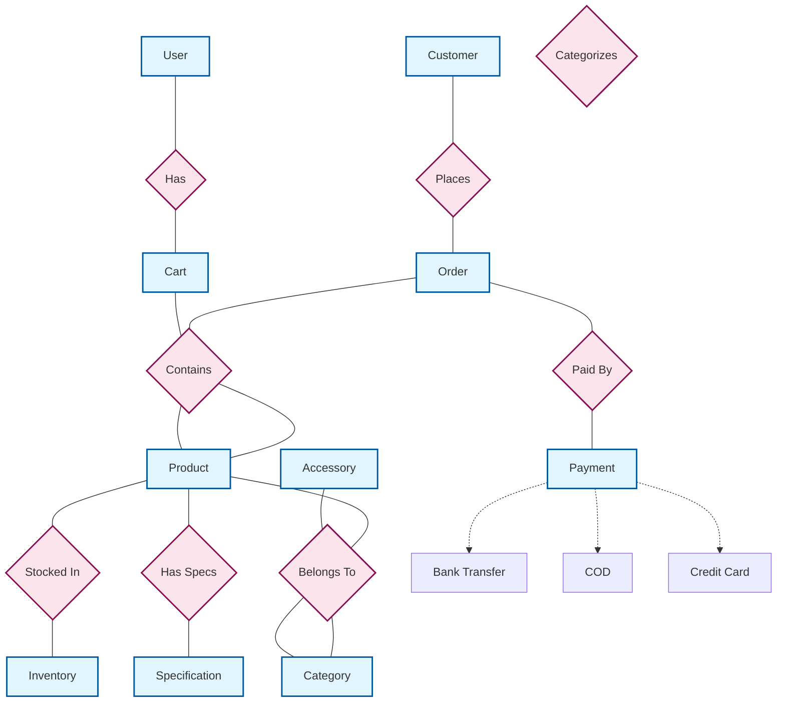
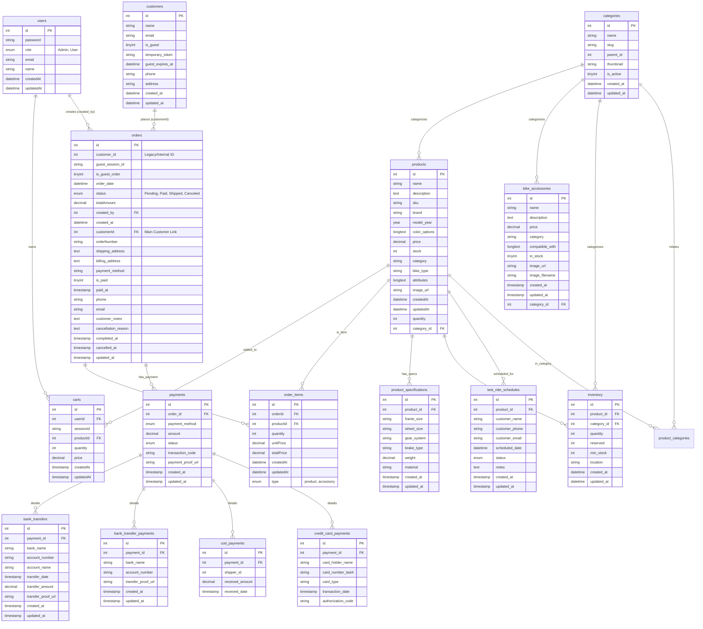

# Database Diagrams

Dưới đây là mô hình cơ sở dữ liệu cho dự án `sms_demo-3.sql`, bao gồm:
1. **Mô hình ER (Entity-Relationship - Mức khái niệm)**: Tập trung vào các thực thể và mối quan hệ nghiệp vụ.
2. **Mô hình ERD (Entity-Relationship Diagram - Mức vật lý)**: Chi tiết cấu trúc bảng, kiểu dữ liệu và khóa ngoại.

---

## 1. Mô hình ER (Conceptual Model)

Mô hình này mô tả các thực thể chính và mối quan hệ giữa chúng bằng ký pháp Chen (giả lập) để dễ hình dung logic nghiệp vụ.

---

## 2. Mô hình ERD (Physical Model)

Mô hình này phản ánh chính xác 100% cấu trúc file `sms_demo-3.sql`, bao gồm tên cột (case-sensitive), kiểu dữ liệu và các mối quan hệ khóa ngoại (Foreign Keys).

