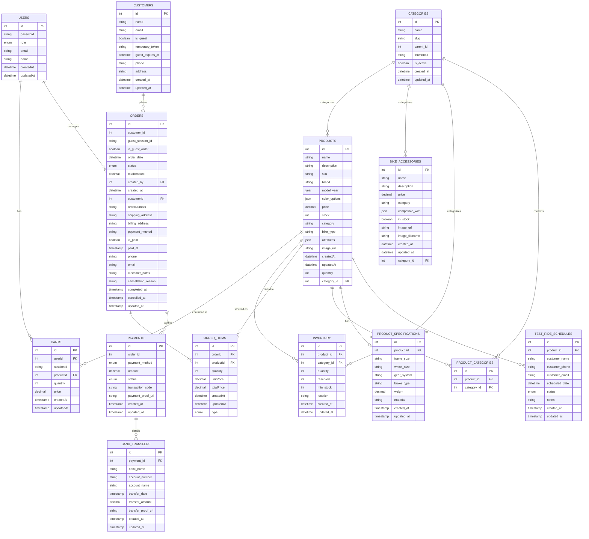
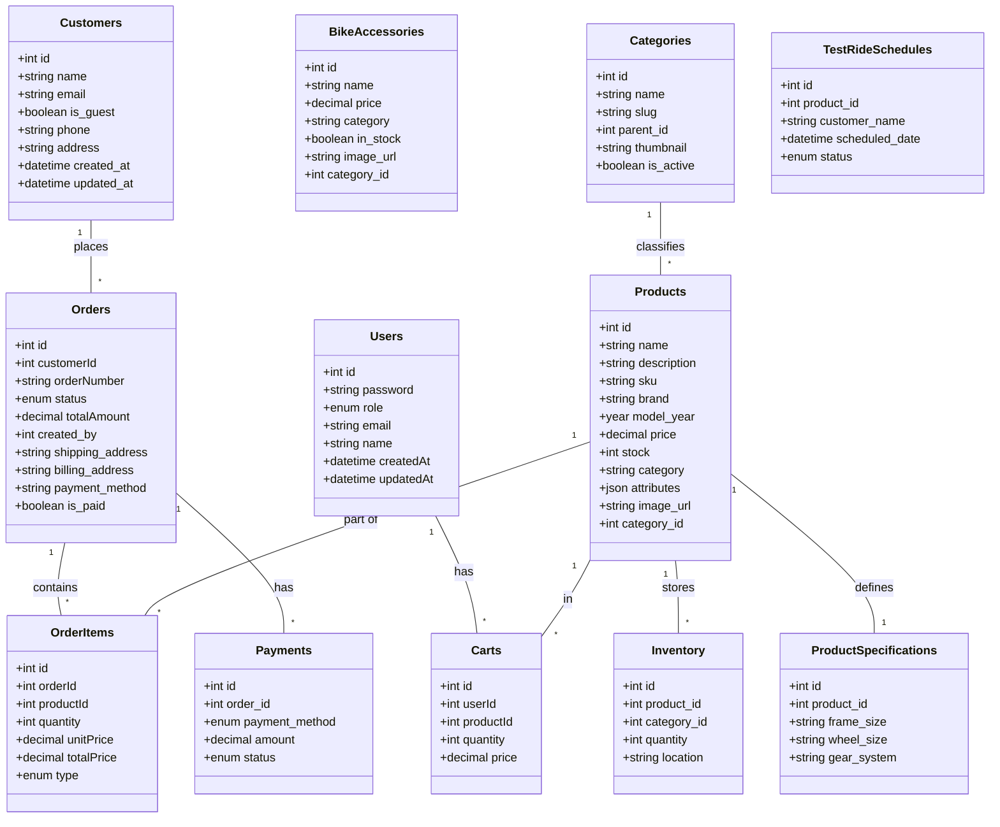

# Database Diagrams

## Entity Relationship Diagram (ERD)

```mermaid
erDiagram
    %% Entities
    USERS {
        int id PK
        string password
        enum role
        string email
        string name
        datetime createdAt
        datetime updatedAt
    }

    CUSTOMERS {
        int id PK
        string name
        string email
        boolean is_guest
        string temporary_token
        datetime guest_expires_at
        string phone
        string address
        datetime created_at
        datetime updated_at
    }

    CATEGORIES {
        int id PK
        string name
        string slug
        int parent_id
        string thumbnail
        boolean is_active
        datetime created_at
        datetime updated_at
    }

    PRODUCTS {
        int id PK
        string name
        string description
        string sku
        string brand
        year model_year
        json color_options
        decimal price
        int stock
        string category
        string bike_type
        json attributes
        string image_url
        datetime createdAt
        datetime updatedAt
        int quantity
        int category_id FK
    }

    BIKE_ACCESSORIES {
        int id PK
        string name
        string description
        decimal price
        string category
        json compatible_with
        boolean in_stock
        string image_url
        string image_filename
        datetime created_at
        datetime updated_at
        int category_id FK
    }

    INVENTORY {
        int id PK
        int product_id FK
        int category_id FK
        int quantity
        int reserved
        int min_stock
        string location
        datetime created_at
        datetime updated_at
    }

    CARTS {
        int id PK
        int userId FK
        string sessionId
        int productId FK
        int quantity
        decimal price
        timestamp createdAt
        timestamp updatedAt
    }

    ORDERS {
        int id PK
        int customer_id
        string guest_session_id
        boolean is_guest_order
        datetime order_date
        enum status
        decimal totalAmount
        int created_by FK
        datetime created_at
        int customerId FK
        string orderNumber
        string shipping_address
        string billing_address
        string payment_method
        boolean is_paid
        timestamp paid_at
        string phone
        string email
        string customer_notes
        string cancellation_reason
        timestamp completed_at
        timestamp cancelled_at
        timestamp updated_at
    }

    ORDER_ITEMS {
        int id PK
        int orderId FK
        int productId FK
        int quantity
        decimal unitPrice
        decimal totalPrice
        datetime createdAt
        datetime updatedAt
        enum type
    }

    PAYMENTS {
        int id PK
        int order_id
        enum payment_method
        decimal amount
        enum status
        string transaction_code
        string payment_proof_url
        timestamp created_at
        timestamp updated_at
    }

    BANK_TRANSFERS {
        int id PK
        int payment_id FK
        string bank_name
        string account_number
        string account_name
        timestamp transfer_date
        decimal transfer_amount
        string transfer_proof_url
        timestamp created_at
        timestamp updated_at
    }

    PRODUCT_CATEGORIES {
        int id PK
        int product_id FK
        int category_id FK
    }

    PRODUCT_SPECIFICATIONS {
        int id PK
        int product_id FK
        string frame_size
        string wheel_size
        string gear_system
        string brake_type
        decimal weight
        string material
        timestamp created_at
        timestamp updated_at
    }

    TEST_RIDE_SCHEDULES {
        int id PK
        int product_id FK
        string customer_name
        string customer_phone
        string customer_email
        datetime scheduled_date
        enum status
        string notes
        timestamp created_at
        timestamp updated_at
    }

    %% Relationships
    USERS ||--o{ CARTS : "has"
    PRODUCTS ||--o{ CARTS : "contained in"
    CATEGORIES ||--o{ PRODUCTS : "categorizes"
    CATEGORIES ||--o{ BIKE_ACCESSORIES : "categorizes"
    CATEGORIES ||--o{ INVENTORY : "categorizes"
    PRODUCTS ||--o{ INVENTORY : "stocked as"
    CUSTOMERS ||--o{ ORDERS : "places"
    USERS ||--o{ ORDERS : "manages"
    ORDERS ||--|{ ORDER_ITEMS : "contains"
    PRODUCTS ||--o{ ORDER_ITEMS : "listed in"
    ORDERS ||--o{ PAYMENTS : "paid by"
    PAYMENTS ||--o{ BANK_TRANSFERS : "details"
    PRODUCTS ||--o{ PRODUCT_CATEGORIES : "belongs to"
    CATEGORIES ||--o{ PRODUCT_CATEGORIES : "contains"
    PRODUCTS ||--o| PRODUCT_SPECIFICATIONS : "has"
    PRODUCTS ||--o{ TEST_RIDE_SCHEDULES : "booked for"
```

## Class Diagram

```mermaid
classDiagram
    class Users {
        +int id
        +string password
        +enum role
        +string email
        +string name
        +datetime createdAt
        +datetime updatedAt
    }

    class Customers {
        +int id
        +string name
        +string email
        +boolean is_guest
        +string phone
        +string address
        +datetime created_at
        +datetime updated_at
    }

    class Products {
        +int id
        +string name
        +string description
        +string sku
        +string brand
        +year model_year
        +decimal price
        +int stock
        +string category
        +json attributes
        +string image_url
        +int category_id
    }

    class BikeAccessories {
        +int id
        +string name
        +decimal price
        +string category
        +boolean in_stock
        +string image_url
        +int category_id
    }

    class Categories {
        +int id
        +string name
        +string slug
        +int parent_id
        +string thumbnail
        +boolean is_active
    }

    class Orders {
        +int id
        +int customerId
        +string orderNumber
        +enum status
        +decimal totalAmount
        +int created_by
        +string shipping_address
        +string billing_address
        +string payment_method
        +boolean is_paid
    }

    class OrderItems {
        +int id
        +int orderId
        +int productId
        +int quantity
        +decimal unitPrice
        +decimal totalPrice
        +enum type
    }

    class Payments {
        +int id
        +int order_id
        +enum payment_method
        +decimal amount
        +enum status
    }

    class Inventory {
        +int id
        +int product_id
        +int category_id
        +int quantity
        +string location
    }

    class Carts {
        +int id
        +int userId
        +int productId
        +int quantity
        +decimal price
    }

    class ProductSpecifications {
        +int id
        +int product_id
        +string frame_size
        +string wheel_size
        +string gear_system
    }

    class TestRideSchedules {
        +int id
        +int product_id
        +string customer_name
        +datetime scheduled_date
        +enum status
    }

    Users "1" -- "*" Carts : has
    Products "1" -- "*" Carts : in
    Customers "1" -- "*" Orders : places
    Orders "1" -- "*" OrderItems : contains
    Products "1" -- "*" OrderItems : part of
    Products "1" -- "*" Inventory : stores
    Categories "1" -- "*" Products : classifies
    Orders "1" -- "*" Payments : has
    Products "1" -- "1" ProductSpecifications : defines
```
