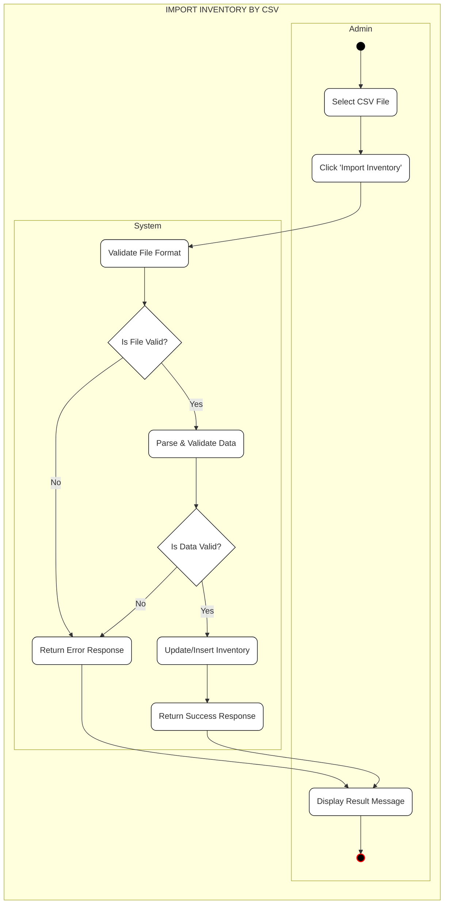
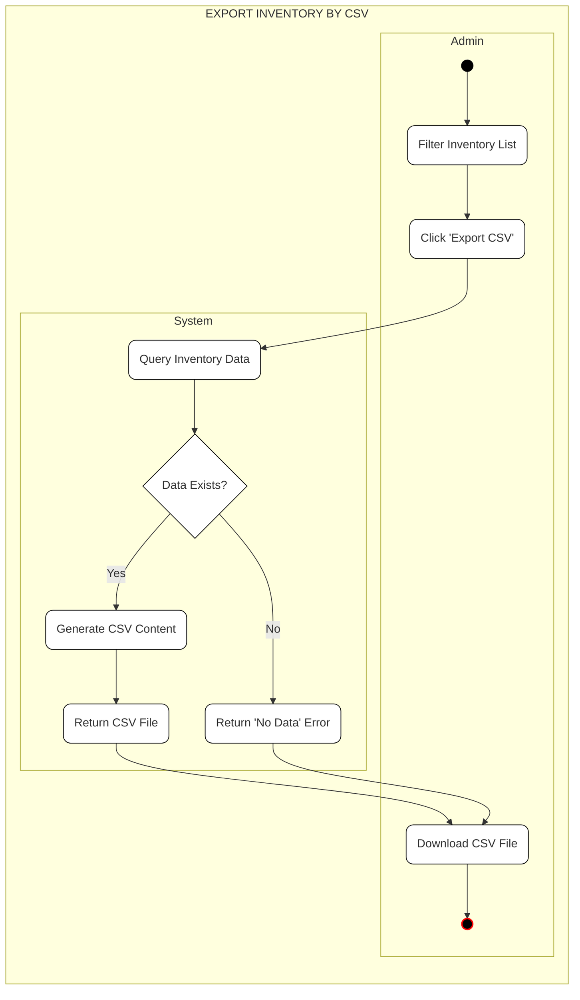
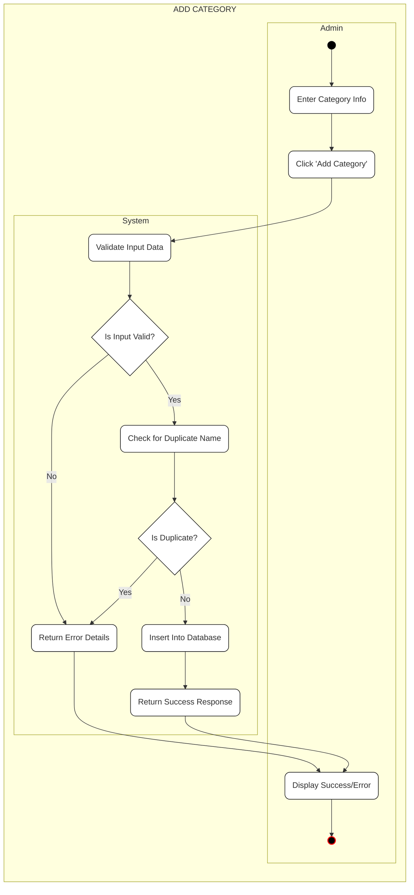
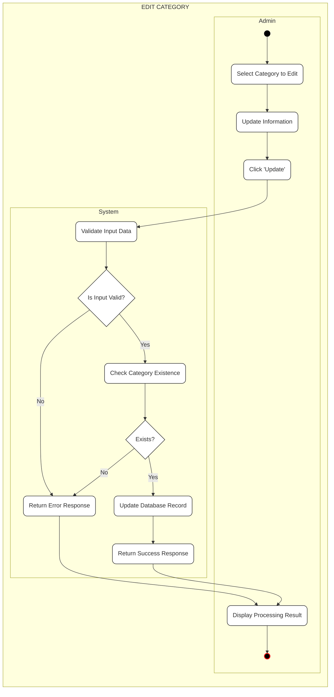
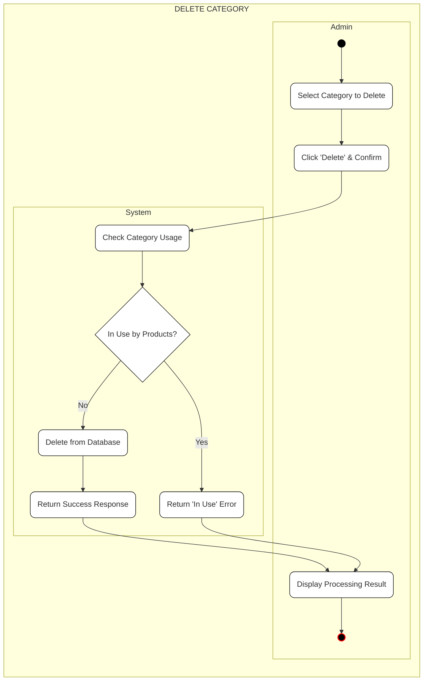
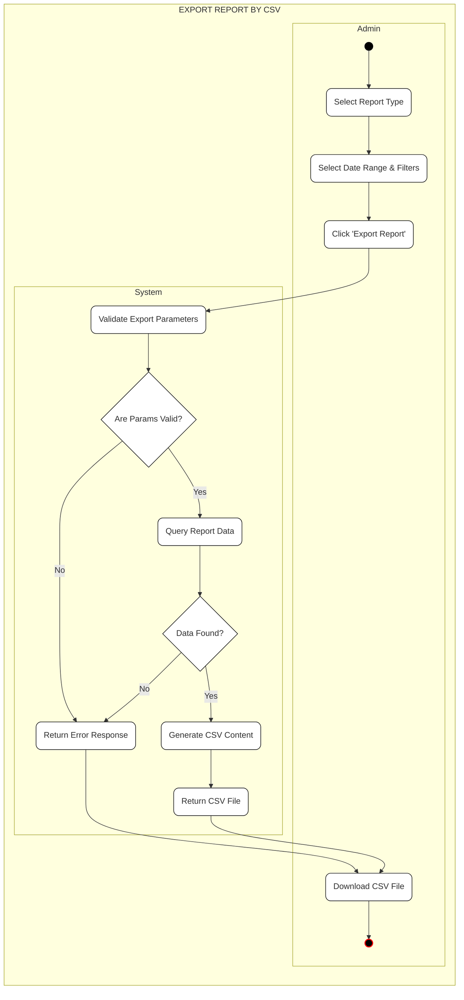

# UML Activity Diagrams

This document contains Activity Diagrams for the project's key functionalities, formatted with Admin and System swimlanes.

---

## 1. Import Inventory by CSV

---

## 2. Export Inventory by CSV

---

## 3. Add Category

---

## 4. Edit Category

---

## 5. Delete Category

---

## 6. Export Report by CSV

