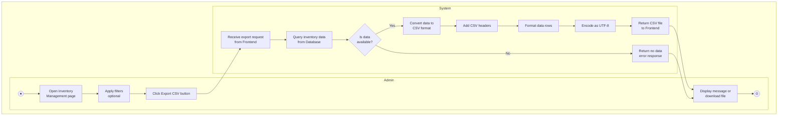
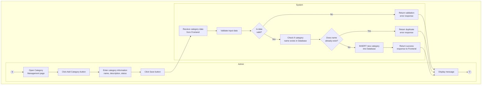
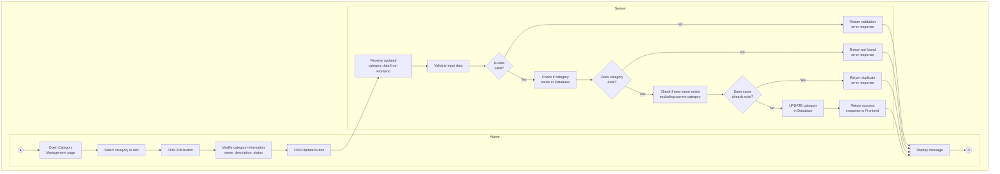
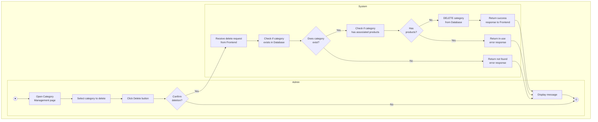

# UML Activity Diagrams - Bicycle Management System

This document contains Activity Diagrams with swimlanes for key functionalities.

---

## 1. IMPORT INVENTORY BY CSV FILE

```mermaid
graph TB
    subgraph " "
        subgraph Admin
            A_start((●))
            A1[Open Inventory<br/>Management page]
            A2[Click Import CSV button]
            A3[Select CSV file<br/>from computer]
            A4[Click Confirm Import]
            A_msg[Display message]
            A_end((⊙))
            
            A_start --> A1
            A1 --> A2
            A2 --> A3
            A3 --> A4
            A_msg --> A_end
        end
        
        subgraph System
            S1[Receive CSV file<br/>from Frontend]
            S2[Validate file format]
            S3{Is file<br/>format valid?}
            S4[Check CSV headers]
            S5{Are headers<br/>valid?}
            S6[Process each row<br/>in CSV file]
            S7[Validate row data]
            S8{Is data<br/>valid?}
            S9[Check if SKU exists<br/>in Database]
            S10{Does SKU<br/>exist?}
            S11[UPDATE inventory<br/>record in Database]
            S12[INSERT new inventory<br/>record in Database]
            S13{More<br/>rows?}
            S14[Return success response<br/>to Frontend]
            S15[Return validation<br/>error response]
            S16[Skip row and<br/>log error]
            
            S1 --> S2
            S2 --> S3
            S3 -->|No| S15
            S3 -->|Yes| S4
            S4 --> S5
            S5 -->|No| S15
            S5 -->|Yes| S6
            S6 --> S7
            S7 --> S8
            S8 -->|No| S16
            S8 -->|Yes| S9
            S9 --> S10
            S10 -->|Yes| S11
            S10 -->|No| S12
            S11 --> S13
            S12 --> S13
            S16 --> S13
            S13 -->|Yes| S6
            S13 -->|No| S14
            S14 --> A_msg
            S15 --> A_msg
        end
        
        A4 --> S1
    end
```

---

## 2. EXPORT INVENTORY BY CSV FILE

---

## 3. ADD CATEGORY

---

## 4. EDIT CATEGORY

---

## 5. DELETE CATEGORY

---

## 6. EXPORT REPORT BY CSV

```mermaid
graph TB
    subgraph " "
        subgraph Admin
            A_start((●))
            A1[Open Reports page]
            A2[Select report type<br/>Sales, Inventory, Orders, Revenue]
            A3[Select date range<br/>start date, end date]
            A4[Apply filters<br/>optional]
            A5[Click Export Report button]
            A_msg[Display message or<br/>download file]
            A_end((⊙))
            
            A_start --> A1
            A1 --> A2
            A2 --> A3
            A3 --> A4
            A4 --> A5
            A_msg --> A_end
        end
        
        subgraph System
            S1[Receive export request<br/>from Frontend]
            S2[Validate parameters<br/>report type, date range]
            S3{Are parameters<br/>valid?}
            S4[Query report data<br/>from Database]
            S5{Is data<br/>available?}
            S6[Process and<br/>aggregate data]
            S7[Convert to CSV format]
            S8[Add CSV headers]
            S9[Format data rows]
            S10[Add summary row]
            S11[Encode as UTF-8]
            S12[Return CSV file<br/>to Frontend]
            S13[Return validation<br/>error response]
            S14[Return no data<br/>error response]
            
            S1 --> S2
            S2 --> S3
            S3 -->|No| S13
            S3 -->|Yes| S4
            S4 --> S5
            S5 -->|No| S14
            S5 -->|Yes| S6
            S6 --> S7
            S7 --> S8
            S8 --> S9
            S9 --> S10
            S10 --> S11
            S11 --> S12
            S12 --> A_msg
            S13 --> A_msg
            S14 --> A_msg
        end
        
        A5 --> S1
    end
```

---

## Diagram Legend

| Symbol | Meaning | Description |
|--------|---------|-------------|
| ● | Initial Node | Start point (black filled circle) |
| ⊙ | Final Node | End point (circle with border) |
| ▭ | Activity Node | Action or process step (rounded rectangle) |
| ⬟ | Decision Node | Branch point with conditions (diamond) |
| → | Flow Arrow | Direction of activity flow |

---

## Notes

### Swimlane Structure
- **Admin Column (Left)**: Contains all user interactions and UI actions
- **System Column (Right)**: Contains all backend processing, validation, and database operations

### Flow Characteristics
- Each diagram has a clear title at the top
- Flows from top to bottom within each swimlane
- Arrows cross between swimlanes to show interaction
- All paths eventually lead to a final node (⊙)

### Decision Nodes
- Diamond shapes represent decision points
- Each decision has Yes/No branches clearly labeled
- Conditions are stated as questions

### Activity Nodes
- Rounded rectangles for all actions
- Multi-line text for detailed descriptions
- Clear, concise action descriptions

---

## Process Summary

| Process | Key Steps | Decision Points | End Result |
|---------|-----------|-----------------|------------|
| **Import Inventory CSV** | Upload → Validate → Process → Update/Insert | File valid? Headers valid? Data valid? SKU exists? | Success with statistics or error message |
| **Export Inventory CSV** | Request → Query → Convert → Generate | Data available? | Download CSV file or error message |
| **Add Category** | Enter info → Validate → Check duplicate → Insert | Data valid? Name exists? | Success or error message |
| **Edit Category** | Select → Modify → Validate → Check → Update | Data valid? Category exists? Name exists? | Success or error message |
| **Delete Category** | Select → Confirm → Check → Delete | Confirm? Category exists? Has products? | Success or warning message |
| **Export Report CSV** | Select type → Date range → Filters → Generate | Parameters valid? Data available? | Download report or error message |
