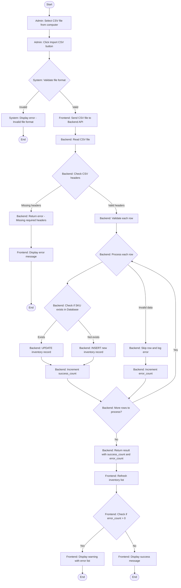
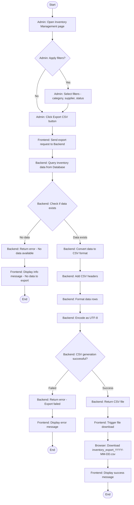
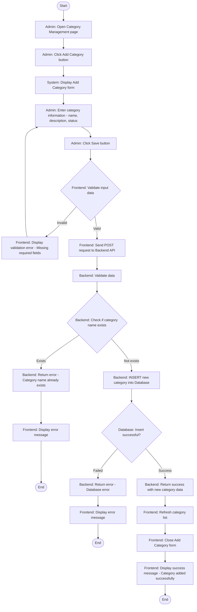
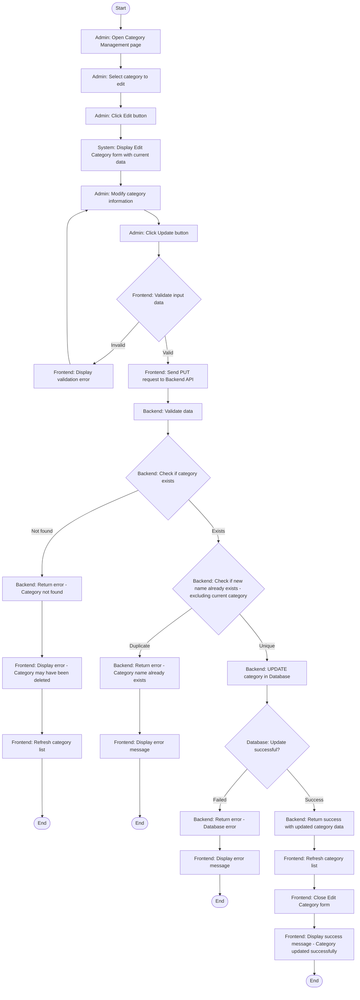
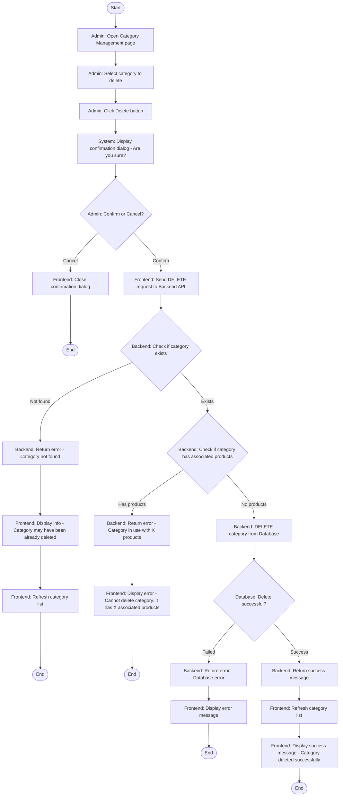
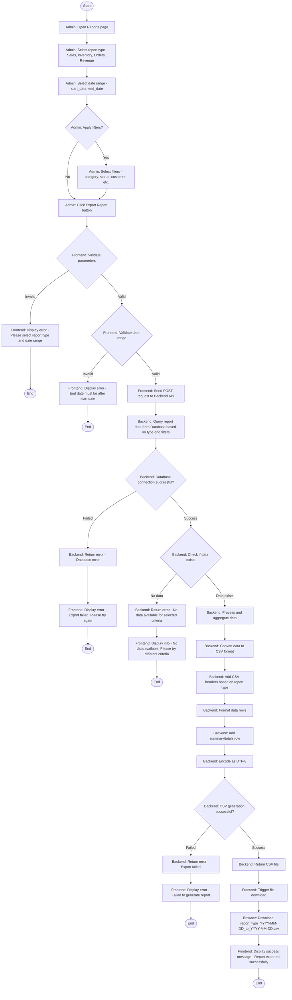

# UML Activity Diagrams - Inventory & Category Management

This document contains UML Activity Diagrams for Inventory Management and Category Management operations.

---

## 1. Import Inventory by CSV File

### Activity Diagram - Import Inventory CSV

---

## 2. Export Inventory by CSV File

### Activity Diagram - Export Inventory CSV

---

## 3. Add Category

### Activity Diagram - Add Category

---

## 4. Edit Category

### Activity Diagram - Edit Category

---

## 5. Delete Category

### Activity Diagram - Delete Category

---

## 6. Export Report by CSV

### Activity Diagram - Export Report CSV

---

## Diagram Conventions

### Symbols Used

- **Rounded Rectangle (Start/End)**: Start and End points
- **Rectangle**: Process/Action steps
- **Diamond**: Decision points
- **Arrow**: Flow direction

### Actor Notation

- **Admin**: Actions performed by the administrator
- **Frontend**: Frontend application processes
- **Backend**: Backend API processes
- **System**: General system processes
- **Database**: Database operations
- **Browser**: Browser actions

### Color Coding (Conceptual)

- **Admin actions**: User interactions
- **Frontend processes**: Client-side validation and UI updates
- **Backend processes**: Server-side logic and validation
- **Database operations**: Data persistence operations
- **Success paths**: Green flow
- **Error paths**: Red flow
- **Decision points**: Yellow/Orange

---

## Notes

1. All activity diagrams follow the swimlane concept with clear separation between Admin and System responsibilities
2. Each diagram includes comprehensive error handling paths
3. Validation occurs at multiple levels (Frontend and Backend)
4. Database operations include success/failure checks
5. User feedback is provided at each critical step
6. All diagrams support the complete user journey from start to end

---

## Flow Summary

| Feature | Main Steps | Decision Points | End States |
|---------|-----------|-----------------|------------|
| **Import Inventory CSV** | Select file → Validate → Process rows → Update DB | File format, Headers, Row data validity | Success, Partial success with errors, Error |
| **Export Inventory CSV** | Apply filters → Request export → Query data → Generate CSV | Data exists, Generation success | Success, No data, Error |
| **Add Category** | Enter data → Validate → Check duplicate → Insert | Input validity, Name uniqueness | Success, Validation error, Duplicate error, DB error |
| **Edit Category** | Modify data → Validate → Check exists → Update | Input validity, Category exists, Name uniqueness | Success, Not found, Duplicate error, DB error |
| **Delete Category** | Confirm → Check exists → Check usage → Delete | User confirmation, Category exists, Has products | Success, Cancelled, Not found, In use, DB error |
| **Export Report CSV** | Select type → Set date range → Apply filters → Query → Generate CSV | Parameters valid, Date range valid, Data exists, Generation success | Success, Validation error, No data, DB error, Generation error |
