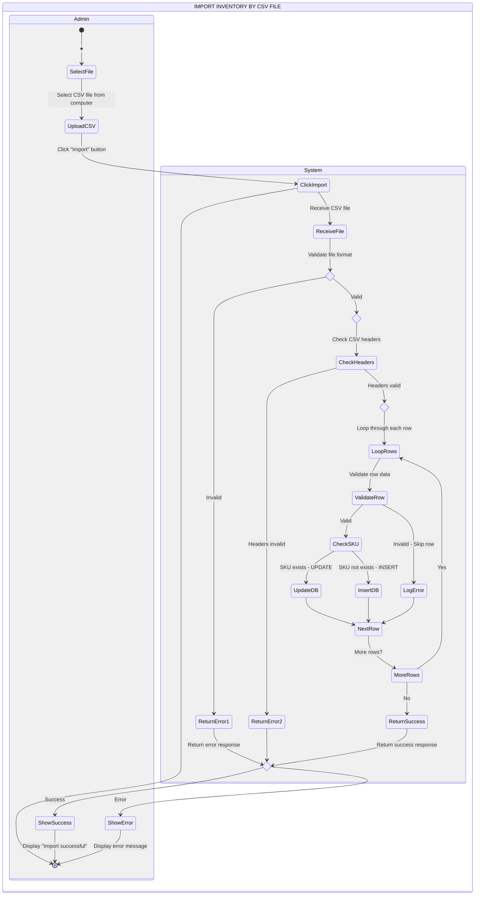
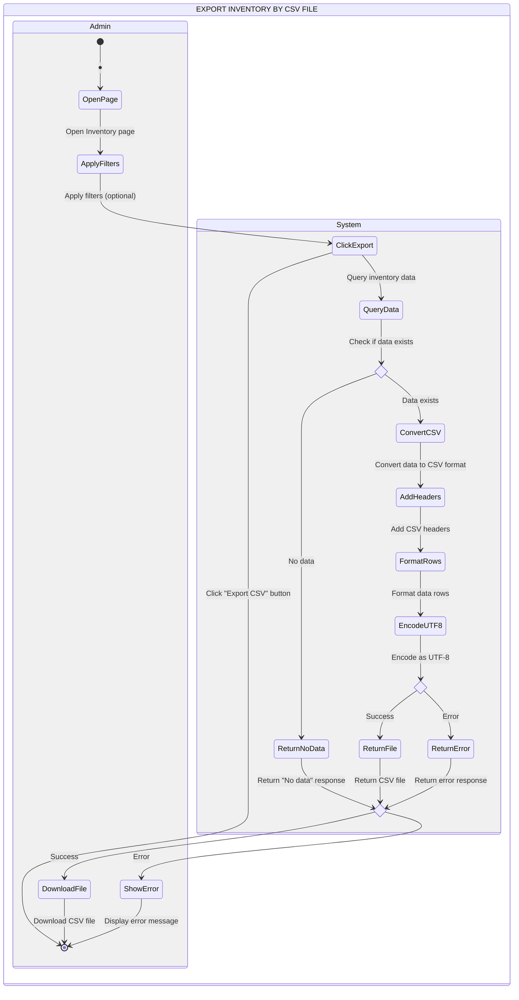
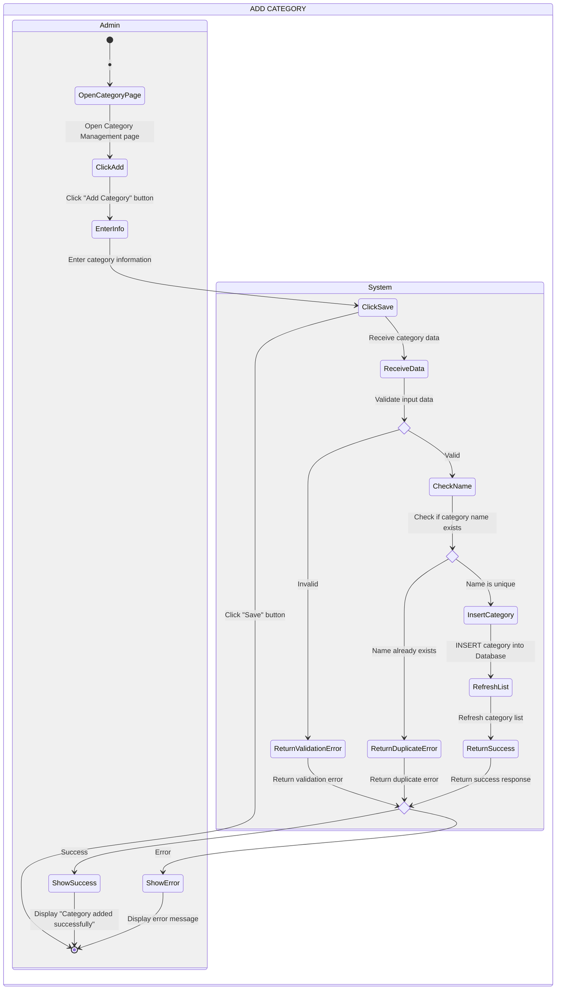
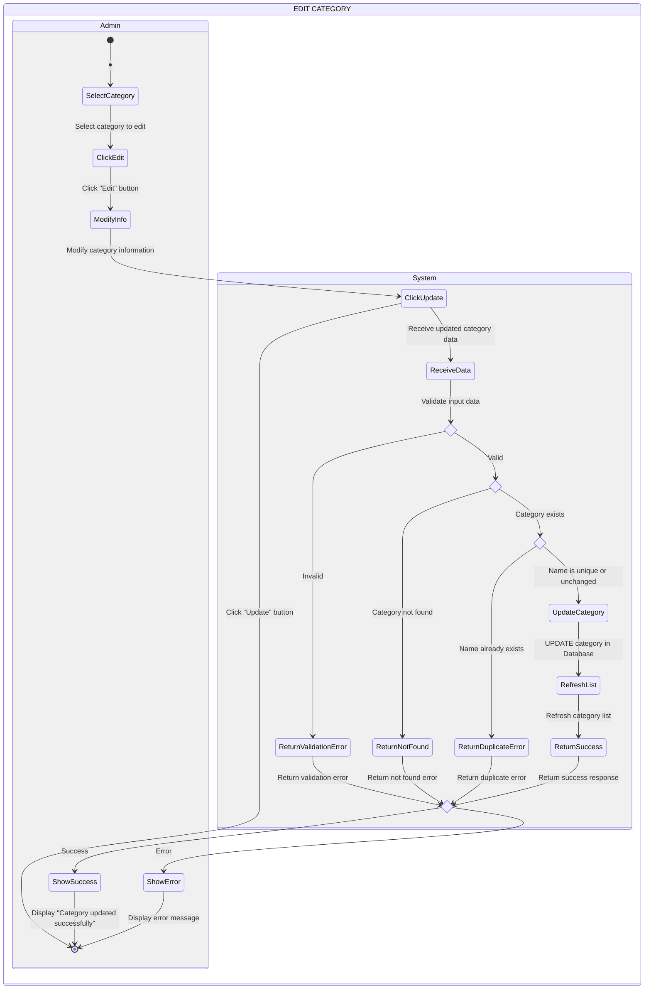
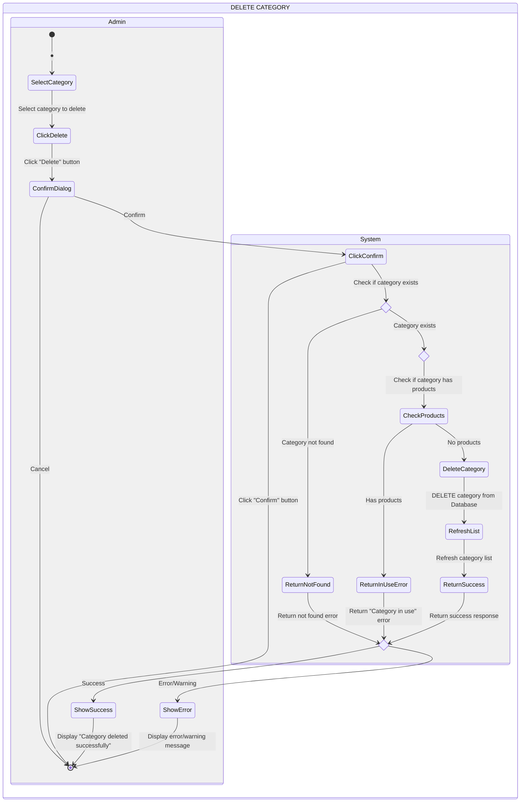
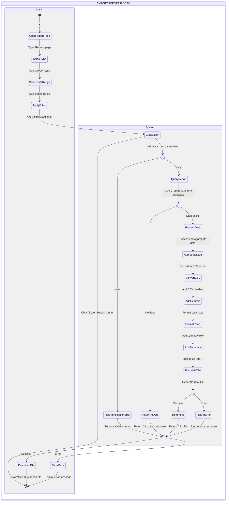

# UML Activity Diagrams - Bicycle Management System

This document contains Activity Diagrams for key functionalities of the Bicycle Management System.

---

## Activity Diagram Components

| Component | Symbol | Function |
|-----------|--------|----------|
| Initial Node | ● (black circle) | Start |
| Activity Node | ▭ (rounded rectangle) | An action |
| Decision Node | ⬟ (diamond) | Branch Yes/No |
| Flow Arrow | → | Activity flow direction |
| Final Node | ⊙ (circle with border) | End |
| Swimlane | Vertical column | Divide responsibility (Admin vs System) |
| Activity Diagram Frame | Frame | Enclose entire process |

---

## 1. Import Inventory by CSV File

---

## 2. Export Inventory by CSV File

---

## 3. Add Category

---

## 4. Edit Category

---

## 5. Delete Category

---

## 6. Export Report by CSV

---

## Notes

### Swimlane Structure
- **Admin Column**: Contains all user actions and interactions
- **System Column**: Contains all backend processing and database operations

### Decision Nodes
- Represented by `<<choice>>` state type in Mermaid
- Branch based on conditions (Valid/Invalid, Success/Error, Yes/No)

### Flow Direction
- Flows from top to bottom
- Crosses between Admin and System swimlanes when interaction occurs
- Returns to Admin column for final display/feedback

### Activity Nodes
- Rounded rectangles represent actions/activities
- Clear, concise descriptions of each step
- Grouped logically within respective swimlanes

### Initial and Final Nodes
- `[*]` represents both initial (●) and final (⊙) nodes
- Each diagram starts with initial node in Admin column
- Each diagram ends with final node in Admin column after displaying result

---

## Diagram Legend

| Symbol | Meaning |
|--------|---------|
| ● | Initial Node (Start) |
| ▭ | Activity Node (Action) |
| ⬟ | Decision Node (Choice) |
| → | Flow Arrow (Direction) |
| ⊙ | Final Node (End) |
| \|\| | Swimlane Separator (Admin \| System) |

---

## Process Summary

### Import Inventory by CSV
1. Admin selects and uploads CSV file
2. System validates file format and headers
3. System processes each row (validate, update/insert)
4. System returns result with success/error count
5. Admin sees success message or error details

### Export Inventory by CSV
1. Admin opens page and applies filters
2. Admin clicks export button
3. System queries and validates data
4. System generates CSV file
5. Admin downloads file or sees error message

### Add Category
1. Admin enters new category information
2. System validates input and checks for duplicates
3. System inserts category into database
4. Admin sees success or error message

### Edit Category
1. Admin modifies existing category information
2. System validates input and checks for duplicates
3. System updates category in database
4. Admin sees success or error message

### Delete Category
1. Admin selects category and confirms deletion
2. System checks if category is in use
3. System deletes category if not in use
4. Admin sees success or warning message

### Export Report by CSV
1. Admin selects report type, date range, and filters
2. System validates parameters and queries data
3. System processes, aggregates, and converts to CSV
4. Admin downloads report file or sees error message
