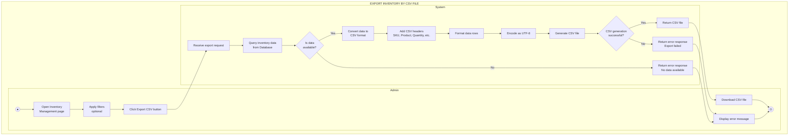
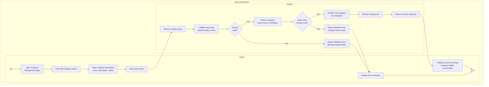
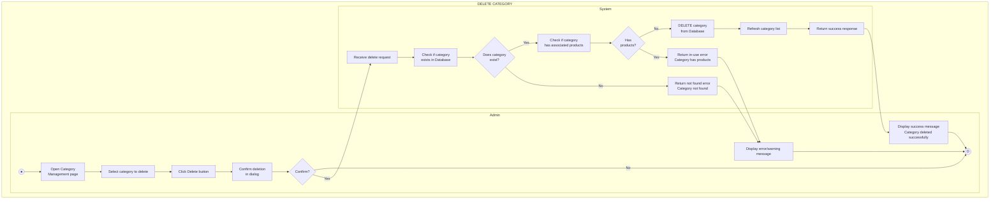

# UML Activity Diagrams - Bicycle Management System

This document contains Activity Diagrams with swimlanes (Admin vs System) for key functionalities.

---

## 1. Import Inventory by CSV File

```mermaid
flowchart TB
    subgraph "IMPORT INVENTORY BY CSV FILE"
        subgraph Admin
            A1((●))
            A2[Open Inventory<br/>Management page]
            A3[Click Import CSV button]
            A4[Select CSV file<br/>from computer]
            A5[Click Confirm Import]
            A6[Display success message<br/>with import statistics]
            A7[Display error message]
            A8((⊙))
            
            A1 --> A2
            A2 --> A3
            A3 --> A4
            A4 --> A5
        end
        
        subgraph System
            S1[Receive CSV file]
            S2[Validate file format<br/>.csv extension]
            S3{Is file<br/>format valid?}
            S4[Check CSV headers]
            S5{Are headers<br/>valid?}
            S6[Process each row]
            S7[Validate row data<br/>SKU, quantity, price]
            S8{Is row<br/>data valid?}
            S9[Check if SKU exists<br/>in Database]
            S10{Does SKU<br/>exist?}
            S11[UPDATE inventory record]
            S12[INSERT new record]
            S13{More<br/>rows?}
            S14[Return success response<br/>with success/error count]
            S15[Return error response<br/>Invalid file format]
            S16[Return error response<br/>Invalid headers]
            S17[Skip row and log error]
            
            S1 --> S2
            S2 --> S3
            S3 -->|Yes| S4
            S3 -->|No| S15
            S4 --> S5
            S5 -->|Yes| S6
            S5 -->|No| S16
            S6 --> S7
            S7 --> S8
            S8 -->|Yes| S9
            S8 -->|No| S17
            S9 --> S10
            S10 -->|Yes| S11
            S10 -->|No| S12
            S11 --> S13
            S12 --> S13
            S17 --> S13
            S13 -->|Yes| S6
            S13 -->|No| S14
            S14 --> A6
            S15 --> A7
            S16 --> A7
        end
        
        A5 --> S1
        A6 --> A8
        A7 --> A8
    end
```

---

## 2. Export Inventory by CSV File

---

## 3. Add Category

---

## 4. Edit Category

```mermaid
flowchart TB
    subgraph "EDIT CATEGORY"
        subgraph Admin
            A1((●))
            A2[Open Category<br/>Management page]
            A3[Select category to edit]
            A4[Click Edit button]
            A5[Modify category information<br/>name, description, status]
            A6[Click Update button]
            A7[Display success message<br/>Category updated successfully]
            A8[Display error message]
            A9((⊙))
            
            A1 --> A2
            A2 --> A3
            A3 --> A4
            A4 --> A5
            A5 --> A6
        end
        
        subgraph System
            S1[Receive updated<br/>category data]
            S2[Validate input data<br/>required fields, format]
            S3{Is input<br/>valid?}
            S4[Check if category<br/>exists in Database]
            S5{Does category<br/>exist?}
            S6[Check if name exists<br/>excluding current category]
            S7{Does name<br/>already exist?}
            S8[UPDATE category<br/>in Database]
            S9[Refresh category list]
            S10[Return success response]
            S11[Return validation error]
            S12[Return not found error<br/>Category not found]
            S13[Return duplicate error<br/>Category name exists]
            
            S1 --> S2
            S2 --> S3
            S3 -->|Yes| S4
            S3 -->|No| S11
            S4 --> S5
            S5 -->|Yes| S6
            S5 -->|No| S12
            S6 --> S7
            S7 -->|No| S8
            S7 -->|Yes| S13
            S8 --> S9
            S9 --> S10
            S10 --> A7
            S11 --> A8
            S12 --> A8
            S13 --> A8
        end
        
        A6 --> S1
        A7 --> A9
        A8 --> A9
    end
```

---

## 5. Delete Category

---

## 6. Export Report by CSV

```mermaid
flowchart TB
    subgraph "EXPORT REPORT BY CSV"
        subgraph Admin
            A1((●))
            A2[Open Reports page]
            A3[Select report type<br/>Sales, Inventory, Orders, Revenue]
            A4[Select date range<br/>start_date, end_date]
            A5[Apply filters<br/>optional]
            A6[Click Export Report button]
            A7[Download CSV report file]
            A8[Display error message]
            A9((⊙))
            
            A1 --> A2
            A2 --> A3
            A3 --> A4
            A4 --> A5
            A5 --> A6
        end
        
        subgraph System
            S1[Receive export request]
            S2[Validate parameters<br/>report type, date range]
            S3{Are parameters<br/>valid?}
            S4[Query report data<br/>from Database]
            S5{Is data<br/>available?}
            S6[Process and aggregate data<br/>calculations, summaries]
            S7[Convert to CSV format]
            S8[Add CSV headers]
            S9[Format data rows]
            S10[Add summary/totals row]
            S11[Encode as UTF-8]
            S12[Generate CSV file]
            S13{CSV generation<br/>successful?}
            S14[Return CSV file]
            S15[Return validation error<br/>Invalid parameters]
            S16[Return no data error<br/>No data available]
            S17[Return generation error<br/>Export failed]
            
            S1 --> S2
            S2 --> S3
            S3 -->|Yes| S4
            S3 -->|No| S15
            S4 --> S5
            S5 -->|Yes| S6
            S5 -->|No| S16
            S6 --> S7
            S7 --> S8
            S8 --> S9
            S9 --> S10
            S10 --> S11
            S11 --> S12
            S12 --> S13
            S13 -->|Yes| S14
            S13 -->|No| S17
            S14 --> A7
            S15 --> A8
            S16 --> A8
            S17 --> A8
        end
        
        A6 --> S1
        A7 --> A9
        A8 --> A9
    end
```

---

## Diagram Legend

| Symbol | Meaning | Description |
|--------|---------|-------------|
| ● | Initial Node | Start point of the activity |
| ⊙ | Final Node | End point of the activity |
| ▭ | Activity Node | An action or process step |
| ⬟ | Decision Node | Branch point with conditions |
| → | Flow Arrow | Direction of activity flow |
| \|\| | Swimlane | Separates Admin and System responsibilities |

---

## Notes

### Swimlane Structure
- **Admin Swimlane**: Contains all user interactions and UI actions
- **System Swimlane**: Contains all backend processing, validation, and database operations

### Decision Nodes
- Diamond shapes represent decision points
- Each decision has clear Yes/No or condition-based branches
- All paths eventually lead to a final node

### Flow Characteristics
- Flows from top to bottom for clarity
- Crosses between swimlanes show interaction between Admin and System
- Each diagram starts with Initial Node (●) in Admin swimlane
- Each diagram ends with Final Node (⊙) in Admin swimlane

### Activity Nodes
- Rounded rectangles represent actions
- Clear, concise descriptions
- Multi-line text for detailed steps

---

## Process Summary

| Process | Admin Actions | System Actions | Result |
|---------|---------------|----------------|--------|
| **Import Inventory CSV** | Select file → Upload → Confirm | Validate → Process rows → Update/Insert DB | Success message with statistics or error |
| **Export Inventory CSV** | Apply filters → Click Export | Query data → Generate CSV | Download file or error message |
| **Add Category** | Enter info → Click Save | Validate → Check duplicate → Insert DB | Success or error message |
| **Edit Category** | Select → Modify → Click Update | Validate → Check duplicate → Update DB | Success or error message |
| **Delete Category** | Select → Click Delete → Confirm | Check exists → Check in-use → Delete DB | Success or warning message |
| **Export Report CSV** | Select type → Date range → Filters → Export | Validate → Query → Process → Generate CSV | Download report or error message |
