# UML Sequence Diagrams - Category Management (Add/Edit/Delete)

This document contains 3 UML Sequence Diagrams for Category Management operations: Add Category, Edit Category, and Delete Category.

---

## 1. Add Category

### Use Case: Add Category

**Actor:** Admin

**Description:** Admin can add a new category to the system by providing category information (name, description, status). The system validates the data, checks for duplicates, creates a new category record via API (addCategory), and updates the category list on the UI.

**Preconditions:**
- Admin is logged in
- Admin has access to Category Management page
- Backend API works fine (getCategories, addCategory)

**Post-conditions:**
- New category is created in database
- Category list on UI is refreshed
- Admin receives success confirmation
- System logs add category activity

---

### Basic Flow - Successful Add Category

```mermaid
sequenceDiagram
    participant Admin
    participant Frontend
    participant Backend
    participant Database

    Admin->>Frontend: 1. Opens Category Management page
    Frontend->>Backend: GET /api/getCategories
    Backend->>Database: Query all categories
    Database-->>Backend: Return category list
    Backend-->>Frontend: Return category list
    Frontend-->>Admin: Display Category Management page

    Admin->>Frontend: 2. Clicks "Add Category" button
    Frontend-->>Admin: Display Add Category form/modal

    Admin->>Frontend: 3. Enters category information<br/>(name, description, status)
    Admin->>Frontend: 4. Clicks "Save" button
    
    Frontend->>Frontend: 5. Validate input data<br/>(required fields, format)
    Frontend->>Backend: 6. POST /api/addCategory<br/>{name, description, status}
    
    Backend->>Backend: 7a. Validate data
    Backend->>Backend: 7b. Check for duplicate category name
    Backend->>Database: Check if category name exists
    Database-->>Backend: Return existing category or null
    
    alt Category name already exists
        Backend-->>Frontend: ❌ Return error {error: "Duplicate category",<br/>message: "Category name already exists"}
        Frontend-->>Admin: ❌ Display error: "Category name already exists"
    else Category name is unique
        Backend->>Database: 8. INSERT new category record
        Database-->>Backend: ✅ Return new category with ID
        Backend-->>Frontend: Return success {status: "success", category: {...}}
        
        Frontend->>Backend: GET /api/getCategories
        Backend->>Database: Query updated categories
        Database-->>Backend: Return updated category list
        Backend-->>Frontend: Return updated category list
        
        Frontend->>Frontend: 9a. Update category list on UI
        Frontend-->>Admin: 9b. ✅ Display success message<br/>"Category added successfully"
        Frontend-->>Admin: Close Add Category form/modal
    end
```



---

### Alternative Flow A1 - Invalid Input Data


---

### Alternative Flow A2 - Backend Error


---

## 2. Edit Category

### Use Case: Edit Category

**Actor:** Admin

**Description:** Admin can edit an existing category by updating its information (name, description, status). The system validates the data, checks for duplicate names (excluding current category), updates the category record via API (updateCategory), and refreshes the category list on the UI.

**Preconditions:**
- Admin is logged in
- Admin has access to Category Management page
- Category to edit exists in the system
- Backend API works fine (getCategories, updateCategory)

**Post-conditions:**
- Category data is updated in database
- Category list on UI is refreshed
- Admin receives update confirmation
- System logs edit category activity

---

### Basic Flow - Successful Edit Category

```mermaid
sequenceDiagram
    participant Admin
    participant Frontend
    participant Backend
    participant Database

    Admin->>Frontend: 1. Opens Category Management page
    Frontend->>Backend: GET /api/getCategories
    Backend->>Database: Query all categories
    Database-->>Backend: Return category list
    Backend-->>Frontend: Return category list
    Frontend-->>Admin: Display Category Management page with category list

    Admin->>Frontend: 2. Clicks "Edit" button on a category
    Frontend-->>Admin: Display Edit Category form/modal<br/>with current category data

    Admin->>Frontend: 3. Modifies category information<br/>(name, description, status)
    Admin->>Frontend: 4. Clicks "Update" button
    
    Frontend->>Frontend: 5. Validate input data<br/>(required fields, format)
    Frontend->>Backend: 6. PUT /api/updateCategory/{id}<br/>{name, description, status}
    
    Backend->>Backend: 7a. Validate data
    Backend->>Backend: 7b. Check for duplicate category name<br/>(excluding current category)
    Backend->>Database: Check if category name exists<br/>(WHERE name = ? AND id != ?)
    Database-->>Backend: Return existing category or null
    
    alt Category name already exists (different category)
        Backend-->>Frontend: ❌ Return error {error: "Duplicate category",<br/>message: "Category name already exists"}
        Frontend-->>Admin: ❌ Display error: "Category name already exists"
    else Category name is unique or unchanged
        Backend->>Database: 8. UPDATE category record
        Database-->>Backend: ✅ Return updated category
        Backend-->>Frontend: Return success {status: "success", category: {...}}
        
        Frontend->>Backend: GET /api/getCategories
        Backend->>Database: Query updated categories
        Database-->>Backend: Return updated category list
        Backend-->>Frontend: Return updated category list
        
        Frontend->>Frontend: 9a. Update category list on UI
        Frontend-->>Admin: 9b. ✅ Display success message<br/>"Category updated successfully"
        Frontend-->>Admin: Close Edit Category form/modal
    end
```



---

### Alternative Flow A1 - Invalid Input Data


---

### Alternative Flow A2 - Category Not Found

```mermaid
sequenceDiagram
    participant Admin
    participant Frontend
    participant Backend
    participant Database

    rect rgb(255, 248, 240)
        Note over Admin,Database: ALTERNATIVE FLOW A2: CATEGORY NOT FOUND
        
        Admin->>Frontend: Clicks "Edit" on a category
        Frontend->>Backend: PUT /api/updateCategory/{id}
        Backend->>Database: Check if category exists
        Database-->>Backend: ⚠️ Category not found
        
        Backend-->>Frontend: ⚠️ Return error {error: "Not found",<br/>message: "Category not found"}
        Frontend-->>Admin: ℹ️ Display error: "Category not found.<br/>It may have been deleted"
        
        Frontend->>Backend: GET /api/getCategories
        Backend->>Database: Query categories
        Database-->>Backend: Return current category list
        Backend-->>Frontend: Return category list
        Frontend->>Frontend: Refresh category list
        
        Note over Admin,Frontend: Admin sees updated list
    end
```



---

### Alternative Flow A3 - Backend Error


---

## 3. Delete Category

### Use Case: Delete Category

**Actor:** Admin

**Description:** Admin can delete an existing category from the system. The system checks if the category is in use (has associated products), confirms deletion with the admin, removes the category record via API (deleteCategory), and updates the category list on the UI.

**Preconditions:**
- Admin is logged in
- Admin has access to Category Management page
- Category to delete exists in the system
- Backend API works fine (getCategories, deleteCategory, checkCategoryUsage)

**Post-conditions:**
- Category is removed from database (if not in use)
- Category list on UI is refreshed
- Admin receives deletion confirmation
- System logs delete category activity

---

### Basic Flow - Successful Delete Category

```mermaid
sequenceDiagram
    participant Admin
    participant Frontend
    participant Backend
    participant Database

    Admin->>Frontend: 1. Opens Category Management page
    Frontend->>Backend: GET /api/getCategories
    Backend->>Database: Query all categories
    Database-->>Backend: Return category list
    Backend-->>Frontend: Return category list
    Frontend-->>Admin: Display Category Management page with category list

    Admin->>Frontend: 2. Clicks "Delete" button on a category
    Frontend-->>Admin: 3. Display confirmation dialog<br/>"Are you sure you want to delete this category?"

    Admin->>Frontend: 4. Clicks "Confirm" button
    
    Frontend->>Backend: 5. DELETE /api/deleteCategory/{id}
    
    Backend->>Backend: 6a. Check if category exists
    Backend->>Database: Check if category has associated products
    Database-->>Backend: Return product count for category
    
    alt Category has associated products
        Backend-->>Frontend: ⚠️ Return error {error: "Category in use",<br/>message: "Cannot delete category with existing products"}
        Frontend-->>Admin: ⚠️ Display error: "Cannot delete category.<br/>It has associated products"
        Note over Admin,Frontend: Deletion prevented
    else Category has no associated products
        Backend->>Database: 7. DELETE category record
        Database-->>Backend: ✅ Confirm deletion
        Backend-->>Frontend: Return success {status: "success", message: "Category deleted"}
        
        Frontend->>Backend: GET /api/getCategories
        Backend->>Database: Query updated categories
        Database-->>Backend: Return updated category list
        Backend-->>Frontend: Return updated category list
        
        Frontend->>Frontend: 8a. Update category list on UI
        Frontend-->>Admin: 8b. ✅ Display success message<br/>"Category deleted successfully"
    end
```



---

### Alternative Flow A1 - User Cancels Deletion


---

### Alternative Flow A2 - Category In Use (Has Products)

```mermaid
sequenceDiagram
    participant Admin
    participant Frontend
    participant Backend
    participant Database

    rect rgb(255, 250, 240)
        Note over Admin,Database: ALTERNATIVE FLOW A2: CATEGORY IN USE
        
        Admin->>Frontend: Clicks "Delete" on a category
        Frontend-->>Admin: Display confirmation dialog
        Admin->>Frontend: Clicks "Confirm"
        
        Frontend->>Backend: DELETE /api/deleteCategory/{id}
        Backend->>Database: Check if category has associated products
        Database-->>Backend: ⚠️ Return product count > 0
        
        Backend-->>Frontend: ⚠️ Return error {error: "Category in use",<br/>message: "Cannot delete category with X products"}
        Frontend-->>Admin: ⚠️ Display error: "Cannot delete category.<br/>It has X associated products.<br/>Please reassign or delete products first"
        
        Note over Admin,Frontend: Deletion prevented to maintain data integrity
    end
```



---

### Alternative Flow A3 - Category Not Found


---

### Alternative Flow A4 - Backend Error


---

## API Endpoints

### 1. Get Categories

**Endpoint:** `GET /api/getCategories`

**Response:**
```json
{
  "status": "success",
  "data": [
    {
      "id": 1,
      "name": "Mountain Bikes",
      "description": "Off-road bicycles",
      "status": "active",
      "product_count": 15,
      "created_at": "2025-01-01T10:00:00Z",
      "updated_at": "2025-01-15T14:30:00Z"
    }
  ],
  "total": 10
}
```

---

### 2. Add Category

**Endpoint:** `POST /api/addCategory`

**Request:**
```json
{
  "name": "Electric Bikes",
  "description": "Battery-powered bicycles",
  "status": "active"
}
```

**Response (Success):**
```json
{
  "status": "success",
  "category": {
    "id": 11,
    "name": "Electric Bikes",
    "description": "Battery-powered bicycles",
    "status": "active",
    "created_at": "2025-12-07T04:25:00Z"
  }
}
```

**Response (Error - Duplicate):**
```json
{
  "status": "error",
  "error": "Duplicate category",
  "message": "Category name already exists"
}
```

---

### 3. Update Category

**Endpoint:** `PUT /api/updateCategory/{id}`

**Request:**
```json
{
  "name": "Electric Bikes",
  "description": "Battery-powered bicycles for urban commuting",
  "status": "active"
}
```

**Response (Success):**
```json
{
  "status": "success",
  "category": {
    "id": 11,
    "name": "Electric Bikes",
    "description": "Battery-powered bicycles for urban commuting",
    "status": "active",
    "updated_at": "2025-12-07T04:30:00Z"
  }
}
```

**Response (Error - Not Found):**
```json
{
  "status": "error",
  "error": "Not found",
  "message": "Category not found"
}
```

---

### 4. Delete Category

**Endpoint:** `DELETE /api/deleteCategory/{id}`

**Response (Success):**
```json
{
  "status": "success",
  "message": "Category deleted successfully"
}
```

**Response (Error - In Use):**
```json
{
  "status": "error",
  "error": "Category in use",
  "message": "Cannot delete category with 15 associated products"
}
```

**Response (Error - Not Found):**
```json
{
  "status": "error",
  "error": "Not found",
  "message": "Category not found"
}
```

---

### 5. Check Category Usage

**Endpoint:** `GET /api/checkCategoryUsage/{id}`

**Response:**
```json
{
  "status": "success",
  "category_id": 1,
  "product_count": 15,
  "can_delete": false
}
```

---

## Validation Rules

### Add/Edit Category Validation

1. **Name Validation:**
   - Required field
   - Max 100 characters
   - Must be unique (case-insensitive)
   - No special characters except spaces and hyphens

2. **Description Validation:**
   - Optional field
   - Max 500 characters

3. **Status Validation:**
   - Required field
   - Allowed values: "active", "inactive"

---

## Flow Summary

### Add Category

| Flow | Description | Result |
|------|-------------|--------|
| **Basic Flow** | Admin enters valid category data | ✅ Category created successfully |
| **A1: Invalid Input** | Missing required fields or invalid format | ❌ Error message, form validation |
| **A1: Duplicate Name** | Category name already exists | ❌ Error message displayed |
| **A2: Backend Error** | Database or server error | ❌ Error message, allows retry |

### Edit Category

| Flow | Description | Result |
|------|-------------|--------|
| **Basic Flow** | Admin updates category with valid data | ✅ Category updated successfully |
| **A1: Invalid Input** | Missing required fields or invalid format | ❌ Error message, form validation |
| **A1: Duplicate Name** | Category name already exists (different category) | ❌ Error message displayed |
| **A2: Not Found** | Category doesn't exist (deleted by another user) | ℹ️ Info message, list refreshed |
| **A3: Backend Error** | Database or server error | ❌ Error message, allows retry |

### Delete Category

| Flow | Description | Result |
|------|-------------|--------|
| **Basic Flow** | Admin deletes category with no associated products | ✅ Category deleted successfully |
| **A1: User Cancels** | Admin cancels deletion in confirmation dialog | ℹ️ No action taken |
| **A2: Category In Use** | Category has associated products | ⚠️ Deletion prevented, error message |
| **A3: Not Found** | Category doesn't exist | ℹ️ Info message, list refreshed |
| **A4: Backend Error** | Database or server error | ❌ Error message, allows retry |

---

## Notes

- **Color coding in diagrams:**
  - 🔵 Blue background (`rgb(240, 248, 255)`): User cancellation flows
  - 🟡 Orange background (`rgb(255, 250, 240)`): Warning flows (in use, not found)
  - 🔴 Red background (`rgb(255, 235, 235)`): Error flows (validation, backend errors)
  - 🔴 Light red background (`rgb(255, 240, 240)`): Input validation errors

- All timestamps are in ISO 8601 format (UTC)
- Category names are case-insensitive for uniqueness check
- Soft delete can be implemented instead of hard delete if needed
- Category status can be used to hide/show categories without deletion
