# UML Sequence Diagram - Export Report by CSV

This document contains UML Sequence Diagrams for Export Report by CSV operation.

---

## Export Report by CSV File

### Use Case: Export Report by CSV File

**Actor:** Admin

**Description:** Admin can export various reports (sales, inventory, orders, revenue) as CSV files for analysis, reporting, or offline processing. The system allows the admin to select report type, apply date range and filters, generates the report data from the backend via API (exportReport), converts it to CSV format, and allows the admin to download the file to their computer.

**Preconditions:**
- Admin is logged in
- Admin has access to Reports page
- Backend has report data available
- API works (getReportTypes, exportReport)

**Post-conditions:**
- CSV report file is downloaded to admin's computer
- No changes to database
- System logs export report activity (timestamp, admin_id, report_type, filters, record_count)
- Original data remains unchanged

---

### Basic Flow - Successful Export


---

### Alternative Flow A1 - No Data Available

```mermaid
sequenceDiagram
    participant Admin
    participant Frontend
    participant Backend
    participant Database

    rect rgb(255, 248, 240)
        Note over Admin,Database: ALTERNATIVE FLOW A1: NO DATA AVAILABLE
        
        Admin->>Frontend: Clicks Export Report button
        Frontend->>Backend: POST /api/exportReport
        Backend->>Database: Query report data
        Database-->>Backend: ⚠️ Return empty result set
        
        Backend->>Backend: Check if data is empty
        Backend-->>Frontend: ⚠️ Return response {error: "No data"}
        
        Frontend-->>Admin: ℹ️ Display info message:<br/>"No data available for the selected criteria"
        
        Note over Admin: No file is downloaded
    end
```



---

### Alternative Flow A2 - Invalid Parameters

```mermaid
sequenceDiagram
    participant Admin
    participant Frontend

    rect rgb(255, 240, 240)
        Note over Admin,Frontend: ALTERNATIVE FLOW A2: INVALID PARAMETERS
        
        Admin->>Frontend: Enters invalid date range or missing parameters
        Admin->>Frontend: Clicks Export Report button
        
        Frontend->>Frontend: Validate export parameters
        
        alt Missing report type
            Frontend-->>Admin: ❌ Display error: "Please select report type"
        else Invalid date range
            Frontend-->>Admin: ❌ Display error: "End date must be after start date"
        end
        
        Note over Admin,Frontend: Admin must correct parameters
    end
```



---

### Alternative Flow A3 - Backend Error

```mermaid
sequenceDiagram
    participant Admin
    participant Frontend
    participant Backend
    participant Database

    rect rgb(255, 235, 235)
        Note over Admin,Database: ALTERNATIVE FLOW A3: BACKEND ERROR
        
        Admin->>Frontend: Clicks Export Report button
        Frontend->>Backend: POST /api/exportReport
        
        alt Database connection error
            Backend->>Database: Query report data
            Database-->>Backend: ❌ Connection error
            Backend-->>Frontend: ❌ Return error {error: "Database error", status: 500}
        else CSV generation error
            Backend->>Database: Query report data
            Database-->>Backend: Return data
            Backend->>Backend: ❌ Attempt to generate CSV fails
            Backend-->>Frontend: ❌ Return error {error: "Export failed", status: 500}
        end
        
        Frontend-->>Admin: ❌ Display error: "Export failed. Please try again"
        
        Admin->>Frontend: Clicks Export Report again (retry)
        Note over Admin,Frontend: Retry export process
    end
```



---

### Optional Flow - Export with Filters


---

## Report Types and Data Specifications

### 1. Sales Report CSV Format

**Description:** Detailed sales transactions within a date range

**Headers (UTF-8):**
```
Order_ID,Date,Customer_Name,Customer_Email,Product_Name,SKU,Quantity,Unit_Price,Total_Amount,Discount,Tax,Grand_Total,Payment_Method,Status
```

**Example Data:**
```csv
Order_ID,Date,Customer_Name,Customer_Email,Product_Name,SKU,Quantity,Unit_Price,Total_Amount,Discount,Tax,Grand_Total,Payment_Method,Status
ORD-001,2025-12-01 10:30:00,John Doe,john@email.com,Mountain Bike X1,MTB-001,1,599.99,599.99,0.00,59.99,659.98,Credit Card,Completed
ORD-002,2025-12-02 14:15:00,Jane Smith,jane@email.com,Road Bike R2,RDB-002,1,899.99,899.99,50.00,84.99,934.98,PayPal,Completed
SUMMARY,,,,,Total Orders: 2,Total Items: 2,,1499.98,50.00,144.98,1594.96,,
```

---

### 2. Inventory Report CSV Format

**Description:** Current inventory status snapshot

**Headers (UTF-8):**
```
SKU,Product_Name,Category,Quantity_In_Stock,Reorder_Level,Unit_Cost,Unit_Price,Total_Value,Supplier,Last_Restocked,Status
```

**Example Data:**
```csv
SKU,Product_Name,Category,Quantity_In_Stock,Reorder_Level,Unit_Cost,Unit_Price,Total_Value,Supplier,Last_Restocked,Status
MTB-001,Mountain Bike X1,Mountain Bikes,15,5,450.00,599.99,6749.85,BikeSupplier Inc,2025-11-15,In Stock
RDB-002,Road Bike R2,Road Bikes,8,3,650.00,899.99,5199.92,BikeSupplier Inc,2025-11-20,In Stock
SUMMARY,,,Total Items: 23,,,Total Value: 11949.77,,,
```

---

### 3. Orders Report CSV Format

**Description:** Summary of orders within a date range

**Headers (UTF-8):**
```
Order_ID,Order_Date,Customer_Name,Customer_Email,Total_Items,Subtotal,Discount,Tax,Shipping,Grand_Total,Payment_Method,Payment_Status,Order_Status
```

**Example Data:**
```csv
Order_ID,Order_Date,Customer_Name,Customer_Email,Total_Items,Subtotal,Discount,Tax,Shipping,Grand_Total,Payment_Method,Payment_Status,Order_Status
ORD-001,2025-12-01 10:30:00,John Doe,john@email.com,2,649.98,5.00,64.49,10.00,719.47,Credit Card,Paid,Delivered
ORD-002,2025-12-02 14:15:00,Jane Smith,jane@email.com,1,899.99,50.00,84.99,15.00,949.98,PayPal,Paid,Shipped
SUMMARY,,,Total Orders: 2,Total Items: 3,1549.97,55.00,149.48,25.00,1669.45,,,
```

---

### 4. Revenue Report CSV Format

**Description:** Revenue summary grouped by period (daily, weekly, monthly)

**Headers (UTF-8):**
```
Period,Period_Start,Period_End,Total_Orders,Total_Items_Sold,Gross_Revenue,Total_Discounts,Total_Tax,Net_Revenue,Average_Order_Value
```

**Example Data:**
```csv
Period,Period_Start,Period_End,Total_Orders,Total_Items_Sold,Gross_Revenue,Total_Discounts,Total_Tax,Net_Revenue,Average_Order_Value
Week 48,2025-11-25,2025-12-01,45,128,25489.55,1245.50,2498.95,26742.00,594.26
Week 49,2025-12-02,2025-12-08,52,145,28765.40,1580.25,2826.54,29011.69,557.92
SUMMARY,2025-11-25,2025-12-08,97,273,54254.95,2825.75,5325.49,55753.69,559.33
```

---

## API Endpoints

### 1. Get Report Types

**Endpoint:** `GET /api/getReportTypes`

**Response:**
```json
{
  "status": "success",
  "report_types": [
    {
      "id": "sales",
      "name": "Sales Report",
      "description": "Detailed sales transactions",
      "requires_date_range": true,
      "available_filters": ["category", "product", "customer", "status"]
    },
    {
      "id": "inventory",
      "name": "Inventory Report",
      "description": "Current inventory status",
      "requires_date_range": false,
      "available_filters": ["category", "supplier", "status"]
    },
    {
      "id": "orders",
      "name": "Orders Report",
      "description": "Order summary",
      "requires_date_range": true,
      "available_filters": ["status", "payment_method", "customer"]
    },
    {
      "id": "revenue",
      "name": "Revenue Report",
      "description": "Revenue analysis by period",
      "requires_date_range": true,
      "available_filters": ["period_type", "category"]
    }
  ]
}
```

---

### 2. Export Report

**Endpoint:** `POST /api/exportReport`

**Request:**
```json
{
  "report_type": "sales",
  "start_date": "2025-12-01",
  "end_date": "2025-12-07",
  "filters": {
    "category": "Mountain Bikes",
    "status": "Completed"
  },
  "format": "csv"
}
```

**Response (Success):**
- Content-Type: text/csv; charset=utf-8
- Content-Disposition: attachment; filename="sales_report_2025-12-01_to_2025-12-07.csv"
- Body: CSV file content

**Response (Error - No Data):**
```json
{
  "status": "error",
  "error": "No data",
  "message": "No data available for the selected criteria"
}
```

**Response (Error - Invalid Parameters):**
```json
{
  "status": "error",
  "error": "Invalid parameters",
  "message": "End date must be after start date"
}
```

**Response (Error - Backend Error):**
```json
{
  "status": "error",
  "error": "Export failed",
  "message": "Failed to generate report",
  "status": 500
}
```

---

## Validation Rules

### Export Report Validation

1. **Report Type Validation:**
   - Required field
   - Must be one of: "sales", "inventory", "orders", "revenue"

2. **Date Range Validation:**
   - start_date: Required for time-based reports (sales, orders, revenue)
   - end_date: Required for time-based reports
   - end_date must be >= start_date
   - Date range should not exceed 1 year (configurable)
   - Format: YYYY-MM-DD or ISO 8601

3. **Filter Validation:**
   - Optional parameters
   - Filters must be valid for the selected report type
   - Filter values must match expected data types

4. **Performance Limits:**
   - Maximum date range: 365 days
   - Maximum records per export: 100,000 rows
   - Large exports may be queued for background processing

---

## Flow Summary

### Export Report - All Flows

| Flow | Description | Result |
|------|-------------|--------|
| **Basic Flow** | Admin selects report type, date range, and filters, then exports successfully | ✅ CSV file is downloaded |
| **A1: No Data** | No data available for selected criteria | ℹ️ Display info message about no data |
| **A2: Invalid Parameters** | Missing report type or invalid date range | ❌ Display validation error |
| **A3: Backend Error** | Database error or CSV generation error | ❌ Display error, allow retry |
| **Optional: Export with Filters** | Admin applies filters before exporting | ✅ CSV file contains only filtered data |

---

## Special Requirements

### Export Requirements

1. **CSV File Format:**
   - UTF-8 encoding
   - Comma (,) as delimiter
   - Double quotes for fields containing commas or special characters
   - Include summary/totals row when applicable

2. **File Naming Convention:**
   - Sales Report: `sales_report_YYYY-MM-DD_to_YYYY-MM-DD.csv`
   - Inventory Report: `inventory_report_YYYY-MM-DD.csv`
   - Orders Report: `orders_report_YYYY-MM-DD_to_YYYY-MM-DD.csv`
   - Revenue Report: `revenue_report_YYYY-MM-DD_to_YYYY-MM-DD.csv`

3. **Performance Optimization:**
   - Large reports (>10,000 rows) should show progress indicator
   - Very large reports (>100,000 rows) should be processed in background
   - Implement pagination for database queries
   - Cache frequently requested reports

4. **Data Formatting:**
   - Dates: ISO 8601 format (YYYY-MM-DD HH:MM:SS)
   - Currency: Decimal with 2 places, no currency symbol
   - Percentages: Decimal format (e.g., 0.15 for 15%)
   - Numbers: Proper thousand separators in display (optional in CSV)

5. **Security:**
   - Verify admin has permission to export reports
   - Log all export activities
   - Sanitize data to prevent CSV injection attacks
   - Rate limiting to prevent abuse

---

## Error Handling

### Export Errors

- **Missing parameters:** Display clear validation message
- **Invalid date range:** Show specific error about date requirements
- **No data available:** Display informational message, suggest different criteria
- **Database connection error:** Display error, suggest retry
- **CSV generation error:** Log error details, display user-friendly message
- **Timeout for large datasets:** Implement background job or pagination

---

## Notes

- **Color coding in diagrams:**
  - 🟢 Green background (`rgb(240, 255, 240)`): Optional filter selection
  - 🟡 Orange background (`rgb(255, 248, 240)`): Warning/no data flows
  - 🔴 Red background (`rgb(255, 235, 235)`): Error flows
  - 🔴 Light red background (`rgb(255, 240, 240)`): Validation errors

- All timestamps are in ISO 8601 format (UTC)
- CSV files use comma (,) as delimiter
- String values containing commas are enclosed in double quotes
- Summary rows are clearly marked and formatted
- Reports can be scheduled for automatic generation (future enhancement)
- Support for multiple export formats (PDF, Excel) can be added
