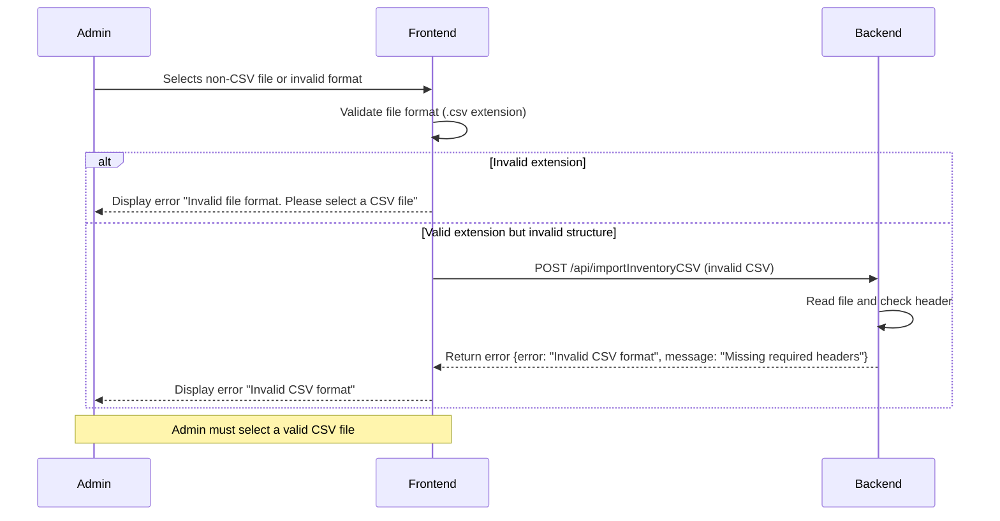
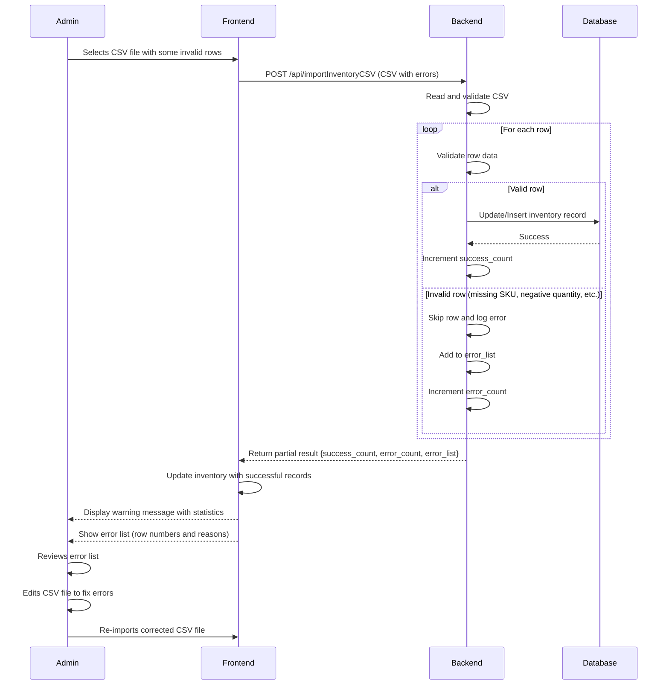
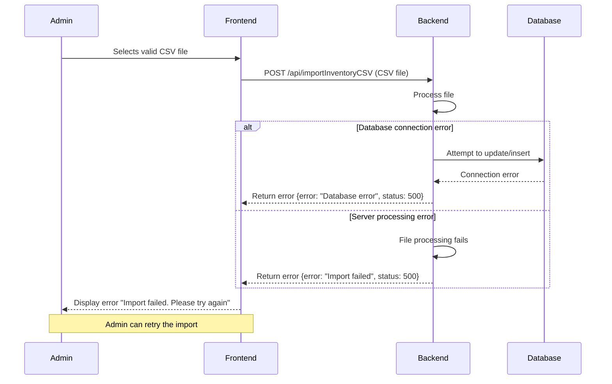
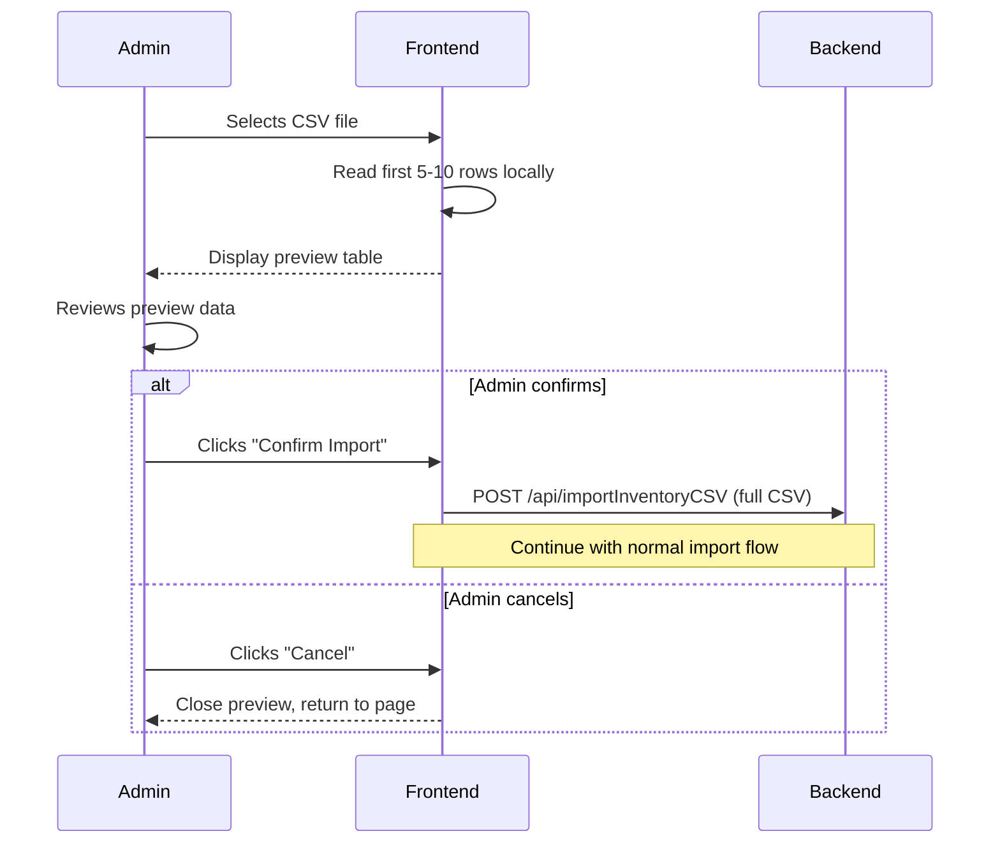
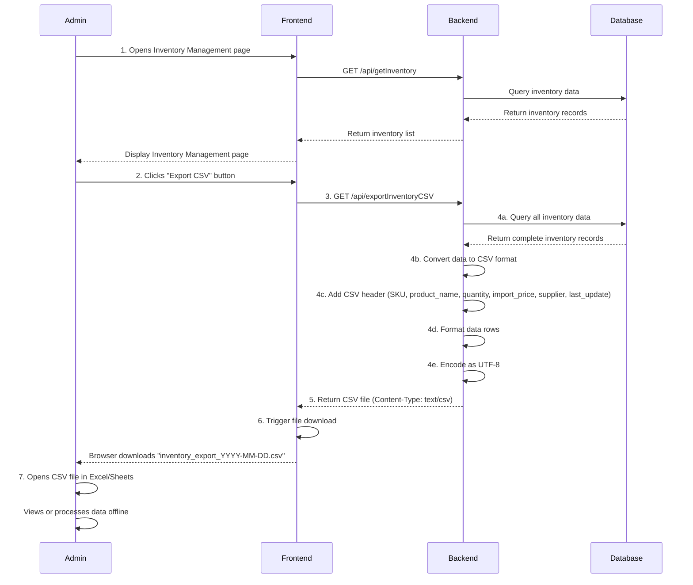
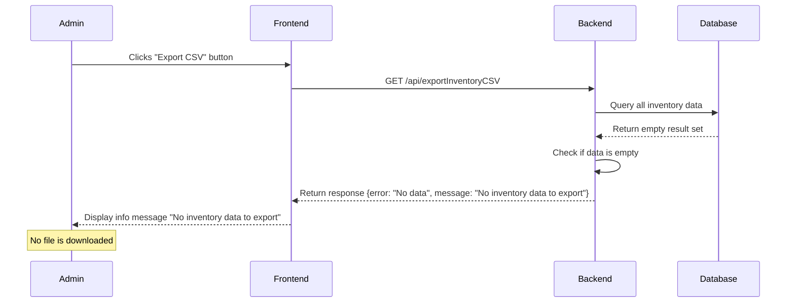
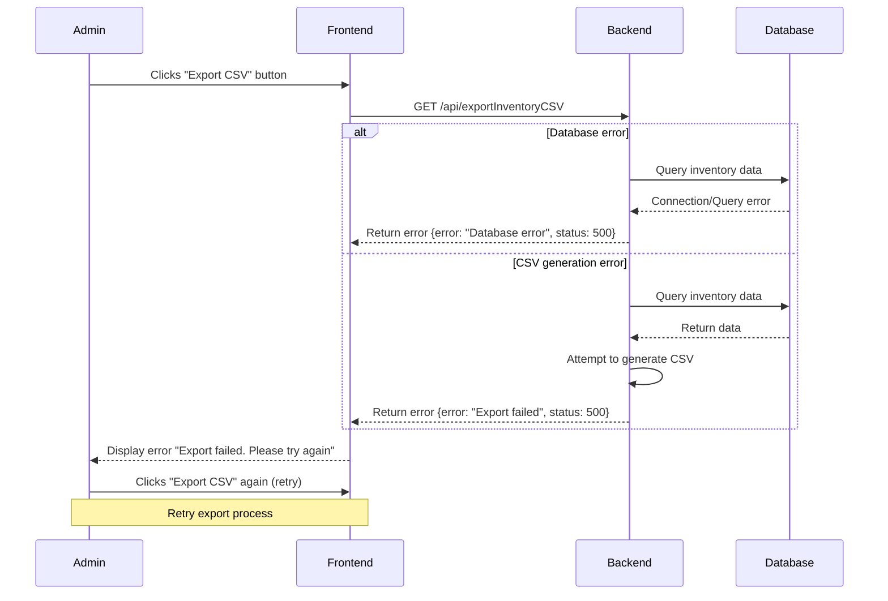
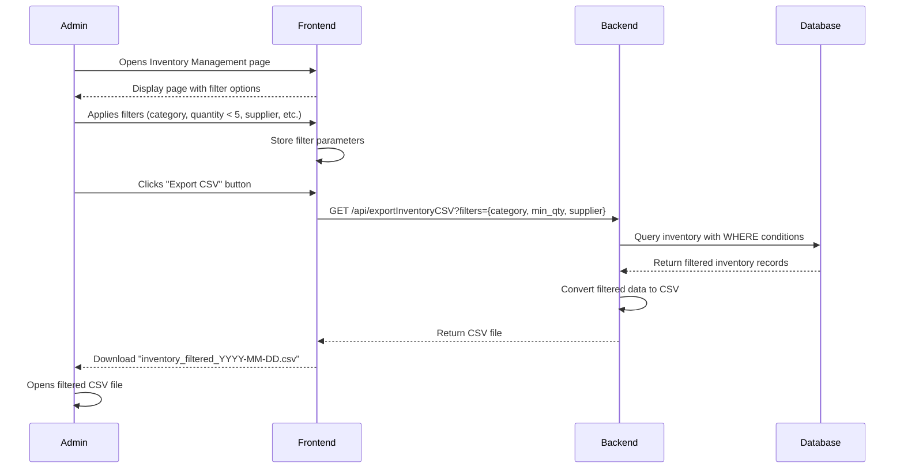

# UML Sequence Diagrams - Inventory Management (CSV Import/Export)

## 1. Import Inventory by CSV File

### Use Case: Import Inventory by CSV File

**Actor:** Admin

**Description:** Admin can import inventory data in bulk by uploading a CSV file containing product information (SKU, product name, quantity, import price, supplier…). The system checks the CSV structure, validates the data, processes each row, updates or adds new inventory records via API (importInventoryCSV), then updates the list on the UI.

---

### Basic Flow - Successful Import


---

### Alternative Flow A1 - Invalid File Format



---

### Alternative Flow A2 - Error Data in CSV



---

### Alternative Flow A3 - Backend Error



---

### Optional Flow - Preview Before Import



---

## 2. Export Inventory by CSV File

### Use Case: Export Inventory by CSV File

**Actor:** Admin

**Description:** Admin can download all inventory data as CSV file for reporting, statistics or offline processing. The system gets inventory data from backend via API (exportInventoryCSV), converts it to CSV and allows admin to download the file to the computer.

---

### Basic Flow - Successful Export



---

### Alternative Flow A1 - No Inventory Data



---

### Alternative Flow A2 - Backend Error



---

### Optional Flow - Export with Filters



---

## Data Specifications

### CSV Import File Format

**Required Headers:**
- SKU (string, unique identifier)
- product_name (string)
- quantity (integer, >= 0)
- import_price (decimal, >= 0)
- supplier (string)

**Optional Headers:**
- category (string)
- description (string)
- last_update (datetime, auto-generated if not provided)

**Example CSV:**
```csv
SKU,product_name,quantity,import_price,supplier,category
BRK-001,Shimano Brake Set,50,45.99,Shimano Inc,Brakes
CHN-002,KMC Chain 10-speed,120,12.50,KMC Chain,Drivetrain
TIR-003,Continental Tire 700x25,80,35.00,Continental,Tires
```

---

### CSV Export File Format

**Headers (UTF-8):**
```
SKU,product_name,quantity,import_price,supplier,last_update
```

**Data Format:**
- SKU: String
- product_name: String (quoted if contains commas)
- quantity: Integer
- import_price: Decimal (2 decimal places)
- supplier: String (quoted if contains commas)
- last_update: ISO 8601 format (YYYY-MM-DD HH:MM:SS)

**Example Export:**
```csv
SKU,product_name,quantity,import_price,supplier,last_update
BRK-001,Shimano Brake Set,50,45.99,Shimano Inc,2025-12-07 03:15:00
CHN-002,KMC Chain 10-speed,120,12.50,KMC Chain,2025-12-06 14:30:00
TIR-003,Continental Tire 700x25,80,35.00,Continental,2025-12-05 09:45:00
```

---

## API Endpoints

### 1. Import Inventory CSV

**Endpoint:** `POST /api/importInventoryCSV`

**Request:**
- Content-Type: multipart/form-data
- Body: CSV file

**Response (Success):**
```json
{
  "status": "success",
  "success_count": 45,
  "error_count": 3,
  "error_list": [
    {"row": 12, "reason": "Missing SKU"},
    {"row": 28, "reason": "Invalid quantity: -5"},
    {"row": 35, "reason": "Invalid price format"}
  ]
}
```

**Response (Error):**
```json
{
  "status": "error",
  "error": "Invalid CSV format",
  "message": "Missing required headers: SKU, quantity"
}
```

---

### 2. Export Inventory CSV

**Endpoint:** `GET /api/exportInventoryCSV`

**Query Parameters (Optional):**
- category: string
- min_quantity: integer
- max_quantity: integer
- supplier: string

**Response (Success):**
- Content-Type: text/csv; charset=utf-8
- Content-Disposition: attachment; filename="inventory_export_2025-12-07.csv"
- Body: CSV file content

**Response (Error):**
```json
{
  "status": "error",
  "error": "No data",
  "message": "No inventory data to export"
}
```

---

### 3. Get Inventory

**Endpoint:** `GET /api/getInventory`

**Response:**
```json
{
  "status": "success",
  "data": [
    {
      "id": 1,
      "sku": "BRK-001",
      "product_name": "Shimano Brake Set",
      "quantity": 50,
      "import_price": 45.99,
      "supplier": "Shimano Inc",
      "category": "Brakes",
      "last_update": "2025-12-07T03:15:00Z"
    }
  ],
  "total": 150
}
```

---

## Validation Rules

### Import Validation

1. **File Validation:**
   - File extension must be `.csv`
   - File size < 10MB
   - Encoding: UTF-8

2. **Header Validation:**
   - Required headers: SKU, product_name, quantity, import_price, supplier
   - Headers are case-insensitive
   - Extra headers are allowed

3. **Data Validation:**
   - SKU: Not empty, max 50 characters
   - product_name: Not empty, max 200 characters
   - quantity: Integer >= 0
   - import_price: Decimal >= 0, max 2 decimal places
   - supplier: Not empty, max 100 characters

4. **Business Rules:**
   - Duplicate SKUs in CSV: Use last occurrence
   - Existing SKU in database: Update record
   - New SKU: Insert new record

---

## Pre-conditions

1. Admin is logged in with valid session
2. Admin has "Inventory Management" permission
3. Admin is on Inventory Management page
4. Backend APIs are operational (getInventory, importInventoryCSV, exportInventoryCSV)
5. Database connection is active
6. For Import: CSV file follows required format (UTF-8, with headers)

---

## Post-conditions

### Import Post-conditions
- Inventory data is updated in database
- Inventory list on UI is refreshed
- Admin receives import result report (success count + error list)
- System logs import activity (timestamp, admin_id, file_name, result)

### Export Post-conditions
- CSV file is downloaded to admin's computer
- No changes to database
- System logs export activity (timestamp, admin_id, record_count)
- Original inventory data remains unchanged

---

## Special Requirements

### Import Requirements
1. System supports previewing first 5-10 rows before importing
2. All quantities must be non-negative integers
3. All prices must be valid decimal numbers (>= 0)
4. SKU is used as unique identifier for matching existing records
5. Import process should be atomic per row (rollback on critical errors)
6. Maximum file size: 10MB
7. Maximum rows per import: 10,000

### Export Requirements
1. CSV file must use UTF-8 encoding
2. Header includes: SKU, product_name, quantity, import_price, supplier, last_update
3. Support exporting with filters (category, quantity range, supplier)
4. File naming convention: `inventory_export_YYYY-MM-DD_HHmmss.csv`
5. Large exports (>10,000 rows) should be paginated or compressed
6. Special characters in data should be properly escaped
7. Decimal numbers formatted with 2 decimal places

---

## Error Handling

### Import Errors
- **Invalid file format:** Display clear error message, prevent upload
- **Missing headers:** Return error with list of missing headers
- **Invalid data types:** Skip row, log error with row number and reason
- **Database errors:** Rollback transaction, display error message
- **Duplicate SKUs in file:** Use last occurrence, log warning

### Export Errors
- **No data available:** Display informational message
- **Database connection error:** Display error, suggest retry
- **CSV generation error:** Log error, display user-friendly message
- **Large dataset timeout:** Implement pagination or background job

---

## Notes

- All timestamps are in ISO 8601 format (UTC)
- CSV files use comma (,) as delimiter
- String values containing commas are enclosed in double quotes
- Empty values are represented as empty strings
- Boolean values: true/false or 1/0
- Currency values: decimal with 2 places, no currency symbol

