# UML Sequence Diagrams - Inventory Management (CSV Import/Export)

This document contains 2 comprehensive UML Sequence Diagrams that combine basic flows and all alternative flows for Inventory CSV Import and Export operations.

---

## 1. Import Inventory by CSV File

### Use Case: Import Inventory by CSV File

**Actor:** Admin

**Description:** Admin can import inventory data in bulk by uploading a CSV file containing product information (SKU, product name, quantity, import price, supplier…). The system checks the CSV structure, validates the data, processes each row, updates or adds new inventory records via API (importInventoryCSV), then updates the list on the UI.

**Preconditions:**
- Admin is logged in
- Admin has access to Inventory Management page
- CSV file is in the required format (UTF-8, with headers)
- Backend API works fine (getInventory, importInventoryCSV)

**Post-conditions:**
- Inventory data is updated in database
- Inventory list on UI is refreshed
- Admin receives import result report (success count + error list)
- System logs import activity

---

### Comprehensive Sequence Diagram - Import Inventory (All Flows Combined)

This diagram shows the complete import flow including:
- **Basic Flow**: Successful import of valid CSV data
- **Alternative Flow A1**: Invalid file format or missing headers
- **Alternative Flow A2**: Error data in some CSV rows
- **Alternative Flow A3**: Backend/Database errors
- **Optional Flow**: Preview before import

```mermaid
sequenceDiagram
    participant Admin
    participant Frontend
    participant Backend
    participant Database

    Admin->>Frontend: 1. Opens Inventory Management page
    Frontend->>Backend: GET /api/getInventory
    Backend->>Database: Query inventory data
    Database-->>Backend: Return inventory records
    Backend-->>Frontend: Return inventory list
    Frontend-->>Admin: Display Inventory Management page

    Admin->>Frontend: 2. Clicks "Import CSV" button
    Frontend-->>Admin: Open file selection dialog

    Admin->>Frontend: 3. Selects CSV file from computer
    
    rect rgb(240, 248, 255)
        Note over Admin,Frontend: OPTIONAL: Preview Before Import
        Frontend->>Frontend: Read first 5-10 rows locally
        Frontend-->>Admin: 📋 Display preview table
        Admin->>Admin: Reviews preview data
        alt Admin cancels
            Admin->>Frontend: ❌ Clicks "Cancel"
            Frontend-->>Admin: Close preview, return to page
            Note over Admin,Frontend: Flow ends here
        end
        Admin->>Frontend: ✅ Clicks "Confirm Import"
    end
    
    Frontend->>Frontend: 4. Validate file format (.csv extension)
    
    alt Invalid file extension
        rect rgb(255, 240, 240)
            Note over Admin,Frontend: ALTERNATIVE FLOW A1: Invalid File Format
            Frontend-->>Admin: ❌ Display error: "Invalid file format.<br/>Please select a CSV file"
            Note over Admin,Frontend: Admin must select a valid CSV file
        end
    else Valid file extension
        Frontend->>Backend: 5. POST /api/importInventoryCSV (CSV file)
        Backend->>Backend: 6a. Read CSV file
        Backend->>Backend: 6b. Check header structure
        
        alt Missing required headers
            rect rgb(255, 240, 240)
                Note over Backend,Frontend: ALTERNATIVE FLOW A1: Invalid CSV Structure
                Backend-->>Frontend: ❌ Return error {error: "Invalid CSV format",<br/>message: "Missing required headers"}
                Frontend-->>Admin: ❌ Display error: "Invalid CSV format"
            end
        else Valid headers
            Backend->>Backend: 6c. Validate each line (SKU, quantity, price, etc.)
            
            Note over Backend,Database: Processing CSV rows
            loop For each row in CSV
                Backend->>Backend: Validate row data
                
                alt Valid row data
                    Backend->>Database: Check if SKU exists
                    Database-->>Backend: Return existing record or null
                    
                    alt SKU exists
                        Backend->>Database: 7b. UPDATE inventory record
                    else SKU does not exist
                        Backend->>Database: 7c. INSERT new inventory record
                    end
                    Database-->>Backend: ✅ Confirm update/insert
                    Backend->>Backend: Increment success_count
                    
                else Invalid row data
                    rect rgb(255, 250, 240)
                        Note over Backend: ALTERNATIVE FLOW A2: Error Data in Row
                        Backend->>Backend: ⚠️ Skip row and log error
                        Backend->>Backend: Add to error_list {row, reason}
                        Backend->>Backend: Increment error_count
                    end
                end
            end
            
            alt Database connection error during processing
                rect rgb(255, 235, 235)
                    Note over Backend,Database: ALTERNATIVE FLOW A3: Backend Error
                    Database-->>Backend: ❌ Connection error
                    Backend-->>Frontend: ❌ Return error {error: "Database error", status: 500}
                    Frontend-->>Admin: ❌ Display error: "Import failed. Please try again"
                    Note over Admin,Frontend: Admin can retry the import
                end
            else Processing completed successfully
                Backend-->>Frontend: 8. Return result {success_count, error_count, error_list}
                
                alt error_count > 0
                    rect rgb(255, 250, 240)
                        Note over Frontend,Admin: Partial Success with Errors
                        Frontend-->>Admin: ⚠️ Display warning with statistics
                        Frontend-->>Admin: Show error list (row numbers and reasons)
                        Admin->>Admin: Reviews error list
                        Admin->>Admin: Edits CSV file to fix errors
                        Note over Admin: Admin can re-import corrected file
                    end
                end
                
                Frontend->>Backend: GET /api/getInventory
                Backend->>Database: Query updated inventory
                Database-->>Backend: Return updated records
                Backend-->>Frontend: Return updated inventory list
                
                Frontend->>Frontend: 9a. Update inventory list on UI
                Frontend-->>Admin: 9b. ✅ Display success message with import statistics
            end
        end
    end
```

---

## 2. Export Inventory by CSV File

### Use Case: Export Inventory by CSV File

**Actor:** Admin

**Description:** Admin can download all inventory data as CSV file for reporting, statistics or offline processing. The system gets inventory data from backend via API (exportInventoryCSV), converts it to CSV and allows admin to download the file to the computer.

**Preconditions:**
- Admin is logged in
- Admin is on Inventory Management page
- Backend has inventory data
- API works (getInventory, exportInventoryCSV)

**Post-conditions:**
- CSV file is downloaded to admin's computer
- No changes to database
- System logs export activity
- Original inventory data remains unchanged

---

### Comprehensive Sequence Diagram - Export Inventory (All Flows Combined)

This diagram shows the complete export flow including:
- **Basic Flow**: Successful export of inventory data
- **Alternative Flow A1**: No inventory data available
- **Alternative Flow A2**: Backend/Database errors or CSV generation errors
- **Optional Flow**: Export with filters

```mermaid
sequenceDiagram
    participant Admin
    participant Frontend
    participant Backend
    participant Database

    Admin->>Frontend: 1. Opens Inventory Management page
    Frontend->>Backend: GET /api/getInventory
    Backend->>Database: Query inventory data
    Database-->>Backend: Return inventory records
    Backend-->>Frontend: Return inventory list
    Frontend-->>Admin: Display Inventory Management page

    rect rgb(240, 255, 240)
        Note over Admin,Frontend: OPTIONAL: Apply Filters Before Export
        Frontend-->>Admin: Display page with filter options
        Admin->>Frontend: Applies filters (category, quantity < 5, supplier, etc.)
        Frontend->>Frontend: Store filter parameters
    end

    Admin->>Frontend: 2. Clicks "Export CSV" button
    
    alt With filters applied
        Frontend->>Backend: 3. GET /api/exportInventoryCSV?filters={category, min_qty, supplier}
    else Without filters
        Frontend->>Backend: 3. GET /api/exportInventoryCSV
    end
    
    alt Database connection error
        rect rgb(255, 235, 235)
            Note over Backend,Database: ALTERNATIVE FLOW A2: Database Error
            Backend->>Database: Query inventory data
            Database-->>Backend: ❌ Connection/Query error
            Backend-->>Frontend: ❌ Return error {error: "Database error", status: 500}
            Frontend-->>Admin: ❌ Display error: "Export failed. Please try again"
            Admin->>Frontend: Clicks "Export CSV" again (retry)
            Note over Admin,Frontend: Retry export process
        end
    else Database query successful
        Backend->>Database: 4a. Query inventory data (with/without filters)
        Database-->>Backend: Return inventory records
        
        alt No data available
            rect rgb(255, 248, 240)
                Note over Backend,Frontend: ALTERNATIVE FLOW A1: No Inventory Data
                Database-->>Backend: ⚠️ Return empty result set
                Backend->>Backend: Check if data is empty
                Backend-->>Frontend: ⚠️ Return response {error: "No data",<br/>message: "No inventory data to export"}
                Frontend-->>Admin: ℹ️ Display info message: "No inventory data to export"
                Note over Admin: No file is downloaded
            end
        else Data available
            Backend->>Backend: 4b. Convert data to CSV format
            Backend->>Backend: 4c. Add CSV header<br/>(SKU, product_name, quantity, import_price, supplier, last_update)
            Backend->>Backend: 4d. Format data rows
            Backend->>Backend: 4e. Encode as UTF-8
            
            alt CSV generation error
                rect rgb(255, 235, 235)
                    Note over Backend,Frontend: ALTERNATIVE FLOW A2: CSV Generation Error
                    Backend->>Backend: ❌ Attempt to generate CSV fails
                    Backend-->>Frontend: ❌ Return error {error: "Export failed", status: 500}
                    Frontend-->>Admin: ❌ Display error: "Export failed. Please try again"
                    Note over Admin,Frontend: Admin can retry
                end
            else CSV generated successfully
                Backend-->>Frontend: 5. Return CSV file (Content-Type: text/csv)
                Frontend->>Frontend: 6. Trigger file download
                
                alt With filters
                    Frontend-->>Admin: 📥 Browser downloads "inventory_filtered_YYYY-MM-DD.csv"
                else Without filters
                    Frontend-->>Admin: 📥 Browser downloads "inventory_export_YYYY-MM-DD.csv"
                end
                
                Admin->>Admin: 7. Opens CSV file in Excel/Sheets
                Admin->>Admin: ✅ Views or processes data offline
            end
        end
    end
```

---

## Flow Summary

### Import Inventory - All Flows Combined

| Flow Type | Trigger Condition | Result |
|-----------|------------------|--------|
| **Basic Flow** | Valid CSV file with all correct data | ✅ All records imported successfully, success message displayed |
| **Optional: Preview** | Admin wants to preview data before import | 📋 Shows first 5-10 rows, allows confirm or cancel |
| **A1: Invalid File** | File extension is not .csv OR missing required headers | ❌ Error message displayed, upload prevented |
| **A2: Error Data** | Some rows have invalid data (missing SKU, negative quantity, wrong format) | ⚠️ Valid rows imported, invalid rows skipped with error list shown |
| **A3: Backend Error** | Database connection fails OR server processing error | ❌ Error message displayed, allows retry |
| **Partial Success** | Mix of valid and invalid rows | ⚠️ Valid data imported, error list provided for correction |

### Export Inventory - All Flows Combined

| Flow Type | Trigger Condition | Result |
|-----------|------------------|--------|
| **Basic Flow** | Database has inventory data, no errors | ✅ CSV file successfully downloaded |
| **Optional: Filters** | Admin applies filters before export | 📥 CSV contains only filtered data |
| **A1: No Data** | Database has no inventory records | ℹ️ Info message displayed, no file downloaded |
| **A2: Database Error** | Database connection or query fails | ❌ Error message displayed, allows retry |
| **A2: CSV Error** | CSV generation process fails | ❌ Error message displayed, allows retry |

---

## Notes

- **Color coding in diagrams:**
  - 🔵 Blue background (`rgb(240, 248, 255)`): Optional flows
  - 🟢 Green background (`rgb(240, 255, 240)`): Filter/optional features
  - 🟡 Orange background (`rgb(255, 250, 240)`): Warning/partial success flows
  - 🔴 Red background (`rgb(255, 235, 235)`): Error flows

- All timestamps are in ISO 8601 format (UTC)
- CSV files use comma (,) as delimiter
- String values containing commas are enclosed in double quotes
- Maximum file size: 10MB
- Maximum rows per import: 10,000
